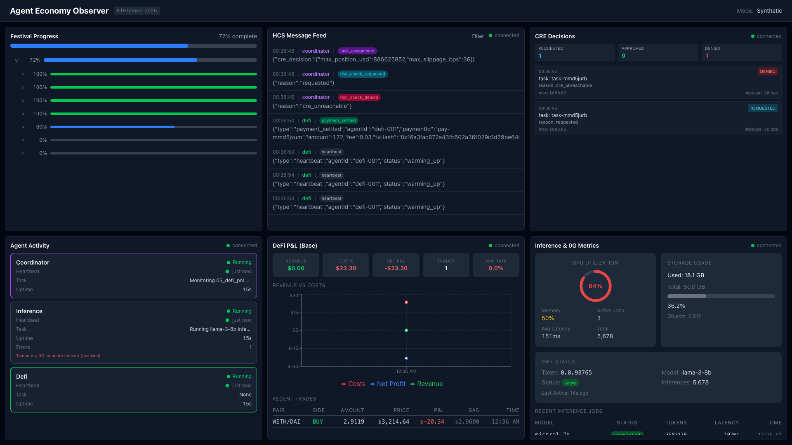

# Obey Agent Economy

**Three AI agents. Three blockchains. One orchestrator.**

## Overview

The Obey Agent Economy is a multi-chain autonomous AI agent system built for ETHDenver 2026. Three specialized Go agents operate across Hedera, 0G, and Base to form a self-sustaining economic cycle, orchestrated by the `obey` daemon and planned using the Festival Methodology.

The system demonstrates a complete agent-to-agent economy: the Coordinator dispatches tasks over Hedera Consensus Service (HCS), the Inference agent executes AI compute on 0G's decentralized GPU network, and the DeFi agent runs trading strategies on Base. Agents are paid in HTS tokens upon task completion. Every message, assignment, result, and payment is published to HCS, creating an immutable on-chain audit trail.

## Built with Obedience Corp

This campaign was created and managed using Obedience Corp's developer tooling:

- **[camp](https://github.com/obedience-corp/camp)** — Campaign CLI for multi-project orchestration. Camp manages the workspace layout, git submodules, navigation shortcuts, and project lifecycle across all six repositories in this submission.
- **[fest](https://github.com/obedience-corp/fest)** — Festival methodology CLI for human-AI collaborative project execution. Every phase of this build — from architecture design to agent wiring to integration testing — was planned, decomposed, and tracked as festivals. See [`festivals/`](festivals/) for the planning artifacts.
- **[obey](https://github.com/obedience-corp/obey)** — Daemon that orchestrates agent sessions within the campaign sandbox, providing sandboxed command execution, event routing, and session lifecycle management.

This repository — its git history, submodule structure, `festivals/` planning directory, and `workflow/` design documents — is a live example of what these products can do.

## Quick Start

```bash
# Clone with submodules
git clone --recursive https://github.com/lancekrogers/ethdenver-2026-campaign.git
cd ethdenver-2026-campaign

# Run the demo (dashboard in mock mode — no env vars needed)
just demo
```

Open `http://localhost:3000` to see all 5 panels with simulated data: Festival View, HCS Feed, Agent Activity, DeFi P&L, and Inference Metrics.

### Full System (requires .env configuration)

```bash
cp .env.example .env         # Fill in Hedera + 0G + Base credentials
just live                    # Build and start all agents + dashboard
docker compose ps            # Verify health status
```

## Dashboard



## Architecture

```
obey daemon (obeyd)
  └── agent-coordinator (Hedera)
        ├── agent-inference (0G)
        └── agent-defi (Base)

dashboard (read-only observer)
contracts (on-chain settlement, Track 2)
```

### Agent Coordinator (Hedera)

The coordinator is the central hub. It reads festival-structured plans, publishes them to HCS as an immutable record, then assigns tasks to agents via HCS topic messages. All inter-agent communication flows through two HCS topics: one for task assignments and results, one for health/status updates.

Every message uses a standardized `Envelope` struct carrying type, sender, recipient, task ID, sequence number, and a type-specific JSON payload. Task types include `task_assignment`, `task_result`, `heartbeat`, `quality_gate`, `payment_settled`, and `pnl_report`.

Tasks follow a strict state machine:

```
pending → assigned → in_progress → review → complete → paid
                                         ↘ in_progress (gate failed)
Any state → failed → pending (retry)
```

On task completion, the coordinator validates a quality gate, then transfers AGT (Agent Token) from the treasury account to the completing agent's Hedera account via `TransferTransaction`.

**Hedera services used (4):**
- **HCS** for all inter-agent messaging (topic create, message submit, mirror node subscription)
- **HTS** for AGT token creation and agent payments (100 AGT per task)
- **Schedule Service** for liveness proofs and deferred settlement (HIP-1215)
- **Account Management** for per-agent testnet accounts with dedicated ED25519 key pairs

### Agent Inference (0G)

The inference agent receives task assignments from HCS, executes AI compute jobs, and returns results with full provenance across all four 0G layers:

1. **0G Compute**: Submits inference jobs to the decentralized GPU broker, polls for results
2. **0G Storage**: Uploads inference results with task metadata tags, receives a `contentID`
3. **0G Chain**: Mints an ERC-7857 iNFT containing AES-encrypted metadata (model config, memory, knowledge base, strategy weights). The iNFT makes the agent's intelligence a tradeable, transferable asset. Only the owner can decrypt the metadata; a TEE oracle handles secure transfer on sale
4. **0G DA**: Publishes an audit event (agent ID, task ID, job ID, storage ref, iNFT ref) to the `inference-audit` namespace

The agent publishes a `task_result` back to HCS containing the storage content ID, iNFT token ID, and DA audit submission ID.

### Agent DeFi (Base)

The DeFi agent executes a mean reversion trading strategy on Uniswap V3 (Base Sepolia), trading the USDC/WETH pair. It runs three concurrent loops:

- **Trading loop**: Fetches market state, evaluates buy/sell signals (2%+ deviation from 30-period moving average), sizes positions by confidence, executes swaps
- **P&L reporting loop**: Publishes periodic reports to HCS with revenue, gas costs, fees, net P&L, win rate, and a self-sustaining flag (target: revenue > 2x costs)
- **Health loop**: Publishes heartbeats to HCS

**Protocols implemented:**
- **ERC-8004** (Trustless Agent Identity): Registers the agent in an on-chain identity registry on Base with verifiable provenance
- **x402** (HTTP Payment Protocol): When a resource responds with HTTP 402, the agent parses the payment invoice, submits USDC on-chain, and retries with proof. The agent pays for its own operational costs autonomously
- **ERC-8021** (Builder Codes): Appends a 20-byte attribution code to every transaction's calldata, making all transactions traceable to Obedience Corp

### Dashboard

A Next.js/React read-only observer UI with five panels:

1. **Festival View**: Hierarchical phase/sequence/task progress with completion percentages and status badges
2. **HCS Feed**: Real-time stream of all HCS messages (timestamps, topic IDs, sequence numbers, message types, senders)
3. **Agent Activity**: Status cards for all three agents showing heartbeats, current task, uptime, and error counts
4. **DeFi P&L**: Revenue, costs, net profit, trade count, win rate, and full trade history with tx hashes
5. **Inference Metrics**: GPU/memory utilization, active jobs, latency, total inferences, storage metrics, iNFT status

Data flows in priority order: Hub WebSocket (primary), direct daemon gRPC (dev fallback), Hedera Mirror Node REST API (historical data).

### Contracts

Three Solidity contracts:

- **AgentSettlement.sol**: Accumulates pending inter-agent payments and batch-settles via HIP-1215 scheduled transactions (Hedera Track 2)
- **ReputationDecay.sol**: Tracks agent activity timestamps and schedules periodic reputation score decay for inactive agents (Hedera Track 2)
- **AgentINFT.sol**: ERC-7857 iNFT for agent inference provenance — stores encrypted metadata, result hashes, and DA references on 0G Chain

### Hiero Plugin

A TypeScript Hiero CLI plugin (`hcli camp`) that extends the Hiero CLI with workspace management. Ships five templates: `hedera-smart-contract` (Hardhat + Hedera testnet), `hedera-dapp` (Vite + React + HashConnect), `hedera-agent` (Go agent with HCS/HTS), `0g-agent` (0G Compute inference), and `0g-inft-build` (ERC-7857 iNFT minting).

## Projects

| Project | Description | Repo |
|---------|-------------|------|
| agent-coordinator | Orchestrates agents via HCS, manages HTS payments | [GitHub](https://github.com/lancekrogers/agent-coordinator-ethden-2026) |
| agent-inference | Routes inference to 0G Compute, maintains ERC-7857 iNFT | [GitHub](https://github.com/lancekrogers/agent-inference-ethden-2026) |
| agent-defi | Executes DeFi strategies on Base, ERC-8004/x402/ERC-8021 | [GitHub](https://github.com/lancekrogers/agent-defi-ethden-2026) |
| dashboard | Next.js observer UI for real-time agent monitoring | [GitHub](https://github.com/lancekrogers/dashboard-ethden-2026) |
| contracts | Solidity contracts for settlement and reputation | [GitHub](https://github.com/lancekrogers/contracts-ethden-2026) |
| hiero-plugin | Hiero CLI plugin for camp workspace management | [GitHub](https://github.com/lancekrogers/hiero-plugin-ethden-2026) |

## Tech Stack

| Layer | Technology | Language |
|-------|------------|----------|
| Agent orchestrator | obey daemon (obeyd) | Go |
| Coordinator agent | hiero-sdk-go v2 | Go |
| Inference agent | go-ethereum (0G Chain bindings) | Go |
| DeFi agent | go-ethereum (Base bindings) | Go |
| Dashboard | Next.js + React | TypeScript |
| Hiero plugin | Node.js (wraps camp binary) | TypeScript |
| Contracts | Solidity + Foundry | Solidity |
| Planning | fest CLI (Festival Methodology) | Go |
| Workspace | camp CLI | Go |
| Build system | just (modular justfiles) | - |

## Directory Structure

| Directory | Purpose |
|-----------|---------|
| `projects/` | Git submodules for all project repos |
| `workflow/` | Code reviews, pipelines, design docs, intents |
| `workflow/design/` | Architecture and design documents |
| `festivals/` | Festival methodology planning |
| `ai_docs/` | AI-generated documentation |
| `docs/` | Human-authored documentation |
| `dungeon/` | Final state or paused work |
