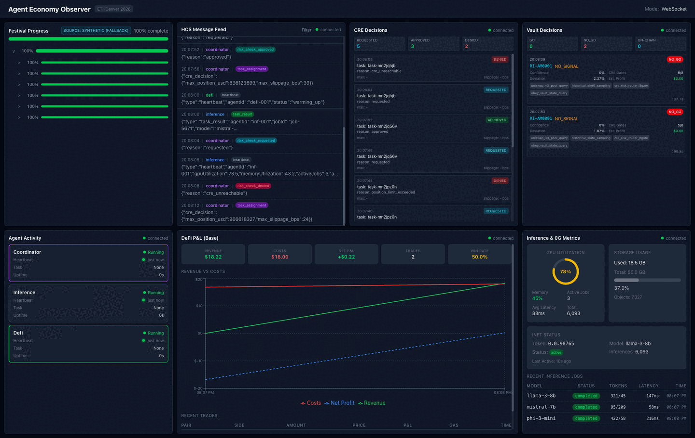

# Obey Agent Economy

**Autonomous AI agents with human-controlled boundaries. Five agents. Five blockchains. Verifiable on-chain.**

### Verified Working Integrations

| Chain / Protocol | What's Deployed & Proven On-Chain | Network |
|-----------------|----------------------------------|---------|
| **Base** | ERC-4626 vault, Uniswap V3 E2E swap, ERC-8004 identity registry, ERC-8021 attribution, x402 payments | Sepolia + Mainnet |
| **Hedera / Hiero** | HCS inter-agent messaging (70+ msgs), HTS token settlement (AGNT), Schedule Service (HIP-1215) | Testnet |
| **0G** | 3 contracts deployed (Settlement, Reputation, iNFT), Compute provider discovery, Storage anchoring, DA audit trail | Galileo Testnet |
| **Chainlink** | CRE Risk Router — 8-gate sequential evaluation, DON consensus broadcast, RiskDecisionReceipt contract | Ethereum Sepolia |
| **Ethereum** | CRE risk evaluation txs, L1→L2 bridge funding | Sepolia |
| **Status Network** | ERC-8004 AgentIdentityRegistry — gasless contract deploy + agent registration (gas=0) | Sepolia |
| **Uniswap** | V3 SwapRouter `exactInputSingle` (verified swap tx), Developer Platform Trading API client | Base Sepolia |
| **Solana** | Prediction market adapters (Drift BET), Bags.fm token integration, Anchor vault programs | Planned / Scaffolded |

**90+ verified transactions** across 6 chains. All contracts deployed and operational on live testnets.

## Key Artifacts

| Artifact | Path | Description |
|----------|------|-------------|
| Agent manifest | [`agent.json`](agent.json) | Machine-readable capability manifest (DevSpot format) |
| Execution log | [`projects/agent-defi/agent_log.json`](projects/agent-defi/agent_log.json) | Structured log with GO/NO_GO decisions, tool calls, on-chain execution |
| Conversation log | [`conversationLog.json`](conversationLog.json) | Human-agent collaboration transcript |
| Ritual decisions | [`festivals/active/agent-market-research-RI-AM0001-*/003_DECIDE/.../decision.json`](festivals/active/) | Real ritual output with confidence, CRE gates, guardrails |
| Deployment evidence | [`projects/contracts/deployments/base-sepolia.json`](projects/contracts/deployments/base-sepolia.json) | Contract addresses and deployment tx hashes |
| Festival planning | [`festivals/`](festivals/) | Full festival methodology artifacts — active, completed, rituals |

## Overview

The Obey Agent Economy is a multi-chain autonomous AI agent system where every agent operates within human-defined spending boundaries enforced at the smart contract level. Agents can trade, predict, infer, and coordinate — but they cannot exceed the limits their human guardian has set. Every decision is verifiable on-chain with full reasoning trails.

Five specialized Go agents operate across Hedera, Base, 0G, Ethereum, and Solana:

- **Coordinator** — dispatches tasks and settles payments over Hedera Consensus Service (HCS)
- **DeFi Agent** — trades USDC/WETH on Uniswap V3 via an ERC-4626 vault with enforced boundaries (max swap size, daily volume, slippage limits, token whitelist)
- **Prediction Agent** — trades binary outcomes on Drift BET, Polymarket, and Limitless using Claude-powered market analysis
- **Inference Agent** — executes AI compute on 0G's decentralized GPU network, mints ERC-7857 iNFTs for inference provenance
- **CRE Risk Router** — evaluates every trade signal through 8 sequential risk gates via Chainlink DON consensus, writing immutable decision receipts on-chain

Agents register on-chain identities via [ERC-8004](https://eips.ethereum.org/EIPS/eip-8004), pay for their own operational costs via [x402](https://x402.org), attribute transactions to their builder via [ERC-8021](https://eips.ethereum.org/EIPS/eip-8021), and coordinate through an immutable HCS audit trail. The entire system is planned and executed using the [Festival Methodology](https://fest.build) — a human-AI collaboration framework where every phase of work is decomposed, tracked, and verifiable.

**90+ verified transactions** across 6 chains. All contracts deployed and operational on live testnets.

## Dashboard



## What Works Today

Everything below runs right now with no daemon required:

- **`just demo`** - Demo mode from campaign root (`just demo up|run|down`). Deterministic CRE scenarios with mock-safe defaults.
- **`just live`** - Live-testnet mode from campaign root (`just live up|run|down`) with fail-fast preflight checks.
- **Go agents build and pass all tests** - `just build all` compiles agents; `just test all` runs the full suite (13 packages, 0 failures).
- **Real DeFi trading on Base Sepolia** - Uniswap V3 swaps through ObeyVault (ERC-4626) with enforced spending boundaries. Verified swap: [tx](https://sepolia.basescan.org/tx/0xafc1c6b2e0ad1e0f0bff17aa86f2cca6ab19ce2859929e5fa066b989d2d3a9d7).
- **ERC-8004 agent identity on Base Mainnet** - Registered and verifiable: [tx](https://basescan.org/tx/0xcc31bda693422433cdc9e364077d29e42bb5a3ade9220d714d33ca44f0832c73).
- **CRE Risk Router on Ethereum Sepolia** - 8-gate risk evaluation via Chainlink DON consensus with on-chain decision receipts.
- **Prediction market agent** - Trades binary outcomes on Drift BET (Solana), Polymarket (Polygon), and Limitless (Base) with Claude-powered analysis.
- **Real 0G Compute integration** - Provider discovery and inference job submission on the Galileo testnet.
- **Real HCS messaging** - Agents publish task assignments, results, heartbeats, and payments to Hedera topics.
- **Solidity contracts** - Full Foundry test suite for ObeyVault, AgentSettlement, ReputationDecay, and AgentINFT.
- **Hiero CLI plugin** - `hcli camp` with 5 templates: `hedera-smart-contract`, `hedera-dapp`, `hedera-agent`, `0g-agent`, `0g-inft-build`.

## What Requires the Obey Daemon

Three dashboard panels need the daemon's WebSocket feed to display live agent data:

- **Agent Activity** - Real-time status cards, heartbeats, current task, uptime (needs `heartbeat` events via WebSocket)
- **DeFi P&L** - Revenue, costs, net profit, trade history with tx hashes (needs `task_result` events via WebSocket)
- **Inference Metrics** - GPU/memory utilization, active jobs, latency, iNFT status (needs `heartbeat` events via WebSocket)

The daemon aggregates gRPC events from all agents into a single WebSocket stream for the dashboard. See [`docs/obey/daemon-requirements.md`](docs/obey/daemon-requirements.md) for the full gRPC and WebSocket contracts.

## Built with Obedience Corp

This campaign was created and managed using Obedience Corp's developer tooling:

- **[camp](https://github.com/obedience-corp/camp)** - Campaign CLI for multi-project orchestration. Camp manages the workspace layout, git submodules, navigation shortcuts, and project lifecycle across all eight repositories in this submission.
- **[festival](https://github.com/obedience-corp/festival)** ([fest.build](https://fest.build)) - The Festival Methodology for human-AI collaborative project execution. Packages both the [`fest`](https://github.com/obedience-corp/fest) and [`camp`](https://github.com/obedience-corp/camp) CLIs with full documentation on the why and how — not just the tools. Every phase of this build was planned, decomposed, and tracked as festivals. See [`festivals/`](festivals/) for the planning artifacts.
- **[obey](https://github.com/obedience-corp/obey)** - Daemon that orchestrates agent sessions within the campaign sandbox, providing sandboxed command execution, event routing, and session lifecycle management.

This repository - its git history, submodule structure, `festivals/` planning directory, and `workflow/` design documents - is a live example of what these products can do.

## Quick Start

```bash
# Clone with submodules
git clone --recursive https://github.com/lancekrogers/Obey-Agent-Economy.git
cd Obey-Agent-Economy

# Install all project dependencies
just install

# Run the demo (dashboard in mock mode - no env vars needed)
just demo
```

Open `http://localhost:3000` to see all 6 panels with simulated data: Festival View, HCS Feed, CRE Decisions, Agent Activity, DeFi P&L, and Inference Metrics.

### Build & Test

```bash
just build all              # Compile all Go agents
just test all               # Run full test suite
just lint                   # Lint all projects
```

### Live Mode (requires .env configuration)

```bash
cp .env.live.example .env.live
just live                    # Runs live preflight then starts full live testnet stack
```

`just live` will fail fast until live-mode contracts are satisfied (for example:
`NEXT_PUBLIC_USE_MOCK=false`, `DEFI_MOCK_MODE=false`, sufficient Base Sepolia
wallet balance, and explicit acknowledgment for the current simulated CRE bridge path).

### Mode Commands

```bash
just mode status             # show env resolution and mode command matrix
just mode doctor             # run live preflight and write JSON report

just demo up                 # dashboard + CRE bridge
just demo run                # deterministic approved/denied CRE scenarios
just demo down

just live up                 # preflight + full stack
just live run                # preflight + stack + smoke scenarios
just live down
```

### Fest Runtime Integration

The coordinator now uses [`fest`](https://github.com/obedience-corp/fest) CLI JSON at runtime to:

- derive task planning input
- publish canonical `festival_progress` HCS events
- mark event source as `fest` (real data) or `synthetic` (fallback)

The dashboard `Festival View` renders a source label for this stream:

- `Source: fest`
- `Source: synthetic (fallback)`

Operator commands from campaign root:

```bash
just fest status             # inspect fest availability and candidate selector
just fest doctor             # strict selector + roadmap validation
just demo run                # fallback-friendly local demo path
just live run                # strict live path (fails fast when fest gates fail)
```

For full mode matrix, troubleshooting, and expected outcomes see:
[`docs/guides/fest-runtime-integration.md`](docs/guides/fest-runtime-integration.md).

### Chainlink Hackathon Demo (justfile-first)

```bash
# Bring up dashboard + agents + CRE bridge (no raw docker compose commands)
just chainlink up

# Run approved + denied CRE scenarios against the live bridge
just chainlink demo

# Capture evidence artifacts for submission packaging
just evidence collect
just evidence validate

# Optional: run CRE broadcast flow for on-chain write proof
just chainlink broadcast

# Teardown
just chainlink down
```

If ports are in use, set `DASHBOARD_PORT` and/or `CRE_BRIDGE_PORT` in `.env.docker` (for example `DASHBOARD_PORT=3001`, `CRE_BRIDGE_PORT=8081`) before running `just chainlink up`.

## On-Chain Evidence

All contracts and agent operations have been deployed and executed on live testnets across 6 chains. **90+ verified transactions** demonstrate the system working end-to-end.

### Base Mainnet (Chain ID 8453)

| Operation | Tx |
|-----------|-----|
| ERC-8004 agent identity registration (Synthesis hackathon) | [`0xcc31bd...`](https://basescan.org/tx/0xcc31bda693422433cdc9e364077d29e42bb5a3ade9220d714d33ca44f0832c73) |

### Base Sepolia (Chain ID 84532)

Wallet: `0xc71d8a19422c649fe9bdcbf3ffa536326c82b58b`

**Contracts:**

| Contract | Address | Deploy Tx |
|----------|---------|-----------|
| ObeyVault (ERC-4626) | `0xbAbDd92397Cd812593e79A5b4c2a32bB4aDb06b1` | [`0x194ca4...`](https://sepolia.basescan.org/tx/0x194ca4e3b078e3d1854911de562f4003a5f4c1bf4167b5ce7eff335a3ca99605) |
| AgentIdentityRegistry (ERC-8004) | `0x0C97820abBdD2562645DaE92D35eD581266CCe70` | [`0x21c529...`](https://sepolia.basescan.org/tx/0x21c52923db732f0b79e0488c8af64fb26fae07b4fd843b8400f9cf7ef872b739) |
| AgentSettlement | `0xa5378FbDCD2799C549A559C1C7c1F91D7C983A44` | [`0xa52f45...`](https://sepolia.basescan.org/tx/0xa52f45a1d4fd1347512da079340f3699f4e7cee7e286e9d46445bb7856d6f8fe) |
| ReputationDecay | `0x54734cC3AF4Db984cD827f967BaF6C64DEAEd0B1` | [`0xbb0b9a...`](https://sepolia.basescan.org/tx/0xbb0b9a2b8fc0dedf5c811e89a8e34e73531c9c077d5c3b11e711f2fb0aa1f97e) |
| AgentINFT (ERC-7857) | `0xfcA344515D72a05232DF168C1eA13Be22383cCB6` | [`0x653d47...`](https://sepolia.basescan.org/tx/0x653d47b30ebc91f870ea302103b743cd7f30a722649b1af67ebe8a9e40af9c92) |

**Agent operations:**

| Operation | Tx |
|-----------|-----|
| ERC-8004 identity registration (AgentRegistered event) | [`0x9b31bd...`](https://sepolia.basescan.org/tx/0x9b31bd785dd7b12649d9d12379546c268aea1da6e0060777bed6276cf8e4002a) |
| Approve WETH as trading token | [`0x8c99cd...`](https://sepolia.basescan.org/tx/0x8c99cd15bdf251ec74aa1e8a2fb080814b845bcf869ebad2f11f5b9d84d76e1a) |
| Approve USDC spend for vault | [`0x8ad4a4...`](https://sepolia.basescan.org/tx/0x8ad4a4ef80d0a4de3421f03f920e2babc5705b26359696bbdcca6bac800ba9f7) |
| Deposit 10 USDC into vault | [`0x261250...`](https://sepolia.basescan.org/tx/0x26125e050928c3d259f545a58f7843651fe4610afcc108e2c2d6524726214473) |
| **E2E swap: 1 USDC -> WETH via Uniswap V3** | [`0xafc1c6...`](https://sepolia.basescan.org/tx/0xafc1c6b2e0ad1e0f0bff17aa86f2cca6ab19ce2859929e5fa066b989d2d3a9d7) |
| L1 bridge funding (Ethereum Sepolia -> Base Sepolia) | [`0xfebaa...`](https://sepolia.etherscan.io/tx/0xfebaae44845667ac09c39b19db4a2b259d85881274e70c3ca41f79245a4cad2c) |

### Hedera Testnet

| Account | Role | Transactions | Link |
|---------|------|-------------|------|
| `0.0.7974114` | Coordinator | 24+ (HCS messages, token transfers, scheduling) | [mirror](https://testnet.mirrornode.hedera.com/api/v1/transactions?account.id=0.0.7974114&limit=25&order=desc) |
| `0.0.7984825` | Inference Agent | 25+ (HCS status reporting) | [mirror](https://testnet.mirrornode.hedera.com/api/v1/transactions?account.id=0.0.7984825&limit=25&order=desc) |
| `0.0.7985425` | DeFi Agent | 24+ (HCS status, token receipts) | [mirror](https://testnet.mirrornode.hedera.com/api/v1/transactions?account.id=0.0.7985425&limit=25&order=desc) |

- **HCS Topics:** `0.0.7999404` (tasks), `0.0.7999405` (status)
- **HTS Token:** `0.0.7999406` (agent economy payment token)
- **Verified tx types:** CONSENSUSSUBMITMESSAGE (70+ HCS messages), CRYPTOTRANSFER (token settlements), SCHEDULECREATE (deferred payments)

### 0G Galileo (Chain ID 16602)

Wallet: `0x38CB2E2eeb45E6F70D267053DcE3815869a8C44d`

**Deployed contracts:**

| Contract | Address | Tx |
|----------|---------|-----|
| ReputationDecay | `0xbdCdBfd93C4341DfE3408900A830CBB0560a62C4` | [`0x5a028b...`](https://chainscan.0g.ai/tx/0x5a028b3fafd2179c3a453dd3f12b0cead16d86e3810e76b4776478dc06350c58) |
| AgentSettlement | `0x437c2bF7a00Da07983bc1eCaa872d9E2B27A3d40` | [`0x30f03a...`](https://chainscan.0g.ai/tx/0x30f03a1777ab8bb0c106260891ec69eb0c0226eaf9243b0456552825698ed89b) |
| AgentINFT (ERC-7857) | `0x17F41075454cf268D0672dd24EFBeA29EF2Dc05b` | [`0x929d4a...`](https://chainscan.0g.ai/tx/0x929d4a74fd6a25ed34e1762181ba842edfa20f76b476a6adc1290db5175a88f4) |

**0G system contracts used:**

| Service | Contract |
|---------|----------|
| Compute (InferenceServing) | `0xa79F4c8311FF93C06b8CfB403690cc987c93F91E` |
| Storage (Flow) | `0x22E03a6A89B950F1c82ec5e74F8eCa321a105296` |
| Data Availability (DA Entrance) | `0xE75A073dA5bb7b0eC622170Fd268f35E675a957B` |

### Ethereum Sepolia (Chain ID 11155111)

**CRE Risk Router contract:** `0x9C7Aa5502ad229c80894E272Be6d697Fd02001d7`
**CRE Forwarder (DON relay):** `0x15fC6ae953E024d975e77382eEeC56A9101f9F88`

| Operation | Tx |
|-----------|-----|
| Deploy RiskDecisionReceipt | [`0x36c066...`](https://sepolia.etherscan.io/tx/0x36c066ba6a3d29abf6888382d5c44c014c7bff4443895cf6a7c84092c4314b46) |
| CRE DON consensus broadcast | [`0xd8505f...`](https://sepolia.etherscan.io/tx/0xd8505ff76caa1e2d17b2ee49b625048f353359fabf68f02abedc9fda87360458) |
| CRE DON consensus broadcast | [`0x4cd1d6...`](https://sepolia.etherscan.io/tx/0x4cd1d6664747b5e2c53f1e10b819b50d437827d632212d204d941b1130c068f2) |
| CRE risk evaluation | [`0xea6784...`](https://sepolia.etherscan.io/tx/0xea6784a79fd108cfb4fc07127ab19b2c9f2a90867fcccc47b339e685fe3169c4) |
| CRE risk evaluation | [`0x0c7292...`](https://sepolia.etherscan.io/tx/0x0c72922fd8e31f859dc5ce30364d87e86c939f7c2a2282899db11b65242dabd1) |

### Status Network Sepolia (Chain ID 1660990954)

Gasless chain — all transactions execute with gas price = 0.

| Operation | Address / Tx |
|-----------|-------------|
| Deploy AgentIdentityRegistry (ERC-8004) | Contract: `0xa5378FbDCD2799C549A559C1C7c1F91D7C983A44` — [`0xe1a15d...`](https://sepoliascan.status.network/tx/0xe1a15d56b07572f4e33573aea81620e20e6f52efbd00b59d748c613dfc1083fa) |
| Register OBEY agent identity (gasless) | [`0x9a3719...`](https://sepoliascan.status.network/tx/0x9a371934e636586c234795ca5bcf0eeb6bc235634fb995ef3d4cee7f5998013c) |

### Evidence Summary

| Chain | Transactions | Contracts | Key Proof |
|-------|-------------|-----------|-----------|
| Base Mainnet | 1 | — | ERC-8004 identity registration |
| Base Sepolia | 11+ | 5 (Vault, Identity, Settlement, Reputation, iNFT) | ObeyVault E2E swap via Uniswap V3 |
| Hedera Testnet | 70+ | — (native HCS/HTS/Schedule) | Inter-agent messaging, AGNT token settlement |
| 0G Galileo | 3 | 3 deployed + 3 system contracts | Settlement, Reputation, ERC-7857 iNFT |
| Ethereum Sepolia | 5+ | 1 (RiskDecisionReceipt) + 1 (CRE Forwarder) | Chainlink DON consensus broadcasts |
| Status Network Sepolia | 2 | 1 (AgentIdentityRegistry) | Gasless deploy + registration |
| **Total** | **90+** | **10 deployed + 4 system** | **6 chains** |

Full evidence manifest: [`workflow/explore/grant-research/2026-03-11/evidence-manifest.md`](workflow/explore/grant-research/2026-03-11/evidence-manifest.md)

## Architecture

```
obey daemon (obeyd)
  └── agent-coordinator (Hedera)
        ├── agent-defi (Base) ──── ObeyVault (ERC-4626)
        ├── agent-prediction (Solana/Polygon/Base)
        └── agent-inference (0G)

cre-risk-router (Ethereum) ── Chainlink DON consensus
contracts (Base/0G) ────────── Settlement, Reputation, iNFT
dashboard (read-only observer)
```

### Agent Coordinator (Hedera)

The coordinator is the central hub. It reads festival-structured plans, publishes them to HCS as an immutable record, then assigns tasks to agents via HCS topic messages. All inter-agent communication flows through two HCS topics: one for task assignments and results, one for health/status updates.

Every message uses a standardized `Envelope` struct carrying type, sender, recipient, task ID, sequence number, and a type-specific JSON payload. Task types include `task_assignment`, `task_result`, `heartbeat`, `quality_gate`, `payment_settled`, and `pnl_report`.

Tasks follow a strict state machine:

```
pending → assigned → in_progress → review → complete → paid
                                         ↘ in_progress (gate failed)
Any state → failed → pending (retry)
```

On task completion, the coordinator validates a quality gate, then transfers AGT (Agent Token) from the treasury account to the completing agent's Hedera account via `TransferTransaction`.

**Hedera services used (4):**
- **HCS** for all inter-agent messaging (topic create, message submit, mirror node subscription)
- **HTS** for AGT token creation and agent payments (100 AGT per task)
- **Schedule Service** for liveness proofs and deferred settlement (HIP-1215)
- **Account Management** for per-agent testnet accounts with dedicated ED25519 key pairs

### Agent Inference (0G)

The inference agent receives task assignments from HCS, executes AI compute jobs, and returns results with full provenance across all four 0G layers:

1. **0G Compute**: Submits inference jobs to the decentralized GPU broker, polls for results
2. **0G Storage**: Uploads inference results with task metadata tags, receives a `contentID`
3. **0G Chain**: Mints an ERC-7857 iNFT containing AES-encrypted metadata (model config, memory, knowledge base, strategy weights). The iNFT makes the agent's intelligence a tradeable, transferable asset. Only the owner can decrypt the metadata; a TEE oracle handles secure transfer on sale
4. **0G DA**: Publishes an audit event (agent ID, task ID, job ID, storage ref, iNFT ref) to the `inference-audit` namespace

The agent publishes a `task_result` back to HCS containing the storage content ID, iNFT token ID, and DA audit submission ID.

### Agent DeFi (Base)

The DeFi agent executes a mean reversion trading strategy on Uniswap V3 (Base Sepolia), trading the USDC/WETH pair. It runs three concurrent loops:

- **Trading loop**: Fetches market state, evaluates buy/sell signals (2%+ deviation from 30-period moving average), sizes positions by confidence, executes swaps
- **P&L reporting loop**: Publishes periodic reports to HCS with revenue, gas costs, fees, net P&L, win rate, and a self-sustaining flag (target: revenue > 2x costs)
- **Health loop**: Publishes heartbeats to HCS

**Protocols implemented:**
- **ERC-8004** (Trustless Agent Identity): Registers the agent in an on-chain identity registry on Base with verifiable provenance
- **x402** (HTTP Payment Protocol): When a resource responds with HTTP 402, the agent parses the payment invoice, submits USDC on-chain, and retries with proof. The agent pays for its own operational costs autonomously
- **ERC-8021** (Builder Codes): Appends a 20-byte attribution code to every transaction's calldata, making all transactions traceable to Obedience Corp

### Dashboard

A Next.js/React read-only observer UI with six panels:

1. **Festival View**: Hierarchical phase/sequence/task progress with completion percentages and status badges
2. **HCS Feed**: Real-time stream of all HCS messages (timestamps, topic IDs, sequence numbers, message types, senders)
3. **CRE Decisions**: Risk-check requested/approved/denied lifecycle with reasons and constraints
4. **Agent Activity**: Status cards for all agents showing heartbeats, current task, uptime, and error counts
5. **DeFi P&L**: Revenue, costs, net profit, trade count, win rate, and full trade history with tx hashes
6. **Inference Metrics**: GPU/memory utilization, active jobs, latency, total inferences, storage metrics, iNFT status

Data flows in priority order: Hub WebSocket (primary), direct daemon gRPC (dev fallback), Hedera Mirror Node REST API (historical data).

### Contracts

Five Solidity contracts deployed to 0G Galileo and Base Sepolia:

- **ObeyVault.sol**: ERC-4626 vault with agent-enforced spending boundaries — token whitelist, max swap size, daily volume cap, slippage limits, guardian pause. Executes Uniswap V3 swaps with TWAP oracle NAV pricing.
- **AgentSettlement.sol**: Accumulates pending inter-agent payments and batch-settles via HIP-1215 scheduled transactions (Hedera Track 2)
- **ReputationDecay.sol**: Tracks agent activity timestamps and schedules periodic reputation score decay for inactive agents (Hedera Track 2)
- **AgentINFT.sol**: ERC-7857 iNFT for agent inference provenance - stores encrypted metadata, result hashes, and DA references on 0G Chain
- **AgentIdentityRegistry.sol**: ERC-8004 agent identity registry on Base - agents register public keys and metadata on-chain for trustless identity verification

### Hiero Plugin

A TypeScript Hiero CLI plugin (`hcli camp`) that extends the Hiero CLI with workspace management. Ships five templates: `hedera-smart-contract` (Hardhat + Hedera testnet), `hedera-dapp` (Vite + React + HashConnect), `hedera-agent` (Go agent with HCS/HTS), `0g-agent` (0G Compute inference), and `0g-inft-build` (ERC-7857 iNFT minting).

## Projects

| Project | Description | Status | Repo |
|---------|-------------|--------|------|
| agent-coordinator | Orchestrates agents via HCS, manages HTS payments | Working | [GitHub](https://github.com/lancekrogers/agent-coordinator) |
| agent-defi | Executes DeFi strategies on Base, ERC-8004/x402/ERC-8021 | Working | [GitHub](https://github.com/lancekrogers/agent-defi) |
| agent-inference | Routes inference to 0G Compute, maintains ERC-7857 iNFT | Code complete | [GitHub](https://github.com/lancekrogers/agent-inference) |
| agent-prediction | Prediction market agent — Drift BET, Polymarket, Limitless | Scaffolded | [GitHub](https://github.com/lancekrogers/agent-prediction) |
| agent-bags | Bags.fm OBEY token lifecycle, fee claiming, Solana/Meteora | Scaffolded | [GitHub](https://github.com/lancekrogers/agent-bags) |
| contracts | Solidity contracts for settlement, reputation, and vaults | Deployed | [GitHub](https://github.com/lancekrogers/contracts) |
| cre-risk-router | Chainlink CRE on-chain risk decision layer (8-gate router) | Deployed | [GitHub](https://github.com/lancekrogers/cre-risk-router) |
| obey-platform | Solana/Anchor vault programs (registry, vault, NAV, fees) | Spec'd | [GitHub](https://github.com/lancekrogers/obey-platform) |
| dashboard | Next.js observer UI for real-time agent monitoring | Working | [GitHub](https://github.com/lancekrogers/dashboard) |
| hiero-plugin | Hiero CLI plugin for camp workspace management (5 templates) | Working | [GitHub](https://github.com/lancekrogers/hiero-plugin) |
| obey-demo-video | Remotion procedural video renderer for hackathon demo | Ready | [GitHub](https://github.com/lancekrogers/obey-demo-video) |

## Tech Stack

| Layer | Technology | Language |
|-------|------------|----------|
| Agent orchestrator | obey daemon (obeyd) | Go |
| Coordinator agent | hiero-sdk-go v2 | Go |
| Inference agent | go-ethereum (0G Chain bindings) | Go |
| DeFi agent | go-ethereum (Base bindings) | Go |
| Dashboard | Next.js + React | TypeScript |
| Hiero plugin | Node.js (wraps camp binary) | TypeScript |
| Contracts | Solidity + Foundry | Solidity |
| Planning | [`fest`](https://github.com/obedience-corp/fest) CLI ([Festival Methodology](https://fest.build)) | Go |
| Workspace | [`camp`](https://github.com/obedience-corp/camp) CLI | Go |
| Build system | just (modular justfiles) | - |

## Directory Structure

| Directory | Purpose |
|-----------|---------|
| `projects/` | Git submodules for all project repos |
| `workflow/` | Code reviews, pipelines, design docs, intents |
| `workflow/design/` | Architecture and design documents |
| `festivals/` | Festival methodology planning |
| `ai_docs/` | AI-generated documentation |
| `docs/` | Human-authored documentation |
| `docs/obey/` | Obey daemon requirements and contracts |
| `dungeon/` | Final state or paused work |
