# System Overview

The hero diagram showing the full topology of the Obey Agent Economy: three Go agents coordinating over Hedera HCS, executing across 0G Galileo, Base Sepolia, and Ethereum Sepolia, with a Next.js dashboard observing everything via Mirror Node and WebSocket.

```mermaid
graph TD
    subgraph Runtime["Runtime Services"]
        COORD["Coordinator<br/><i>Go · hiero-sdk-go</i>"]
        INF["Inference Agent<br/><i>Go · go-ethereum</i>"]
        DEFI["DeFi Agent<br/><i>Go · go-ethereum</i>"]
        CRE["CRE Bridge<br/><i>Go HTTP :8080</i>"]
        DAEMON["Obey Daemon<br/><i>gRPC :50051</i>"]
        DASH["Dashboard<br/><i>Next.js :3000</i>"]
    end

    subgraph Hedera["Hedera Network"]
        HCS_TASK["HCS Task Topic"]
        HCS_STATUS["HCS Status Topic"]
        HTS["HTS AGNT Token"]
        MIRROR["Mirror Node REST"]
        SCHED["Schedule Service"]
    end

    subgraph ZeroG["0G Galileo Testnet"]
        ZG_SERVE["InferenceServing<br/><i>provider discovery</i>"]
        ZG_FLOW["Flow Contract<br/><i>storage anchoring</i>"]
        ZG_DA["DA Entrance<br/><i>audit trail</i>"]
        ZG_INFT["ERC-7857 iNFT<br/><i>provenance</i>"]
    end

    subgraph Base["Base Sepolia"]
        UNI["Uniswap V3 Router"]
        ERC8004["ERC-8004 Identity"]
        X402["x402 Payment"]
        ERC8021["ERC-8021 Attribution"]
    end

    subgraph Ethereum["Ethereum Sepolia"]
        RECEIPT["RiskDecisionReceipt.sol"]
        DON["Chainlink DON"]
    end

    %% Coordinator ↔ HCS
    COORD -->|"publish task_assignment"| HCS_TASK
    HCS_TASK -->|"subscribe"| INF
    HCS_TASK -->|"subscribe"| DEFI
    INF -->|"publish task_result"| HCS_STATUS
    DEFI -->|"publish pnl_report"| HCS_STATUS
    HCS_STATUS -->|"subscribe"| COORD

    %% Payments
    COORD -->|"HTS transfer"| HTS
    HTS -->|"payment to"| INF
    HTS -->|"payment to"| DEFI
    COORD -->|"scheduled heartbeat"| SCHED

    %% CRE integration
    COORD -->|"POST /evaluate-risk"| CRE
    CRE -->|"WASM pipeline"| DON
    DON -->|"consensus write"| RECEIPT

    %% Daemon connections
    COORD -->|"gRPC Register/Heartbeat"| DAEMON
    INF -->|"gRPC Register/Heartbeat"| DAEMON
    DEFI -->|"gRPC Register/Heartbeat"| DAEMON
    DAEMON -->|"WebSocket events"| DASH

    %% Dashboard observation
    DASH -->|"REST polling"| MIRROR
    MIRROR -.->|"HCS messages"| HCS_TASK
    MIRROR -.->|"HCS messages"| HCS_STATUS

    %% 0G connections
    INF -->|"getAllServices()"| ZG_SERVE
    INF -->|"submit(dataRoot)"| ZG_FLOW
    INF -->|"submitOriginalData()"| ZG_DA
    INF -->|"mint(encrypted)"| ZG_INFT

    %% Base connections
    DEFI -->|"exactInputSingle()"| UNI
    DEFI -->|"register()"| ERC8004
    DEFI -->|"HTTP 402 handshake"| X402
    ERC8021 -.->|"appended to calldata"| UNI

    %% Styles
    classDef hedera fill:#8259EF,color:#fff,stroke:#6b48cc
    classDef zerog fill:#00D4AA,color:#000,stroke:#00b894
    classDef base fill:#0052FF,color:#fff,stroke:#003ecc
    classDef ethereum fill:#3C3C3D,color:#fff,stroke:#2a2a2a
    classDef runtime fill:#2d3436,color:#fff,stroke:#636e72
    classDef dashboard fill:#00b4d8,color:#000,stroke:#0077b6

    class COORD,INF,DEFI,CRE,DAEMON runtime
    class DASH dashboard
    class HCS_TASK,HCS_STATUS,HTS,MIRROR,SCHED hedera
    class ZG_SERVE,ZG_FLOW,ZG_DA,ZG_INFT zerog
    class UNI,ERC8004,X402,ERC8021 base
    class RECEIPT,DON ethereum
```

## Key Relationships

- **Coordinator** is the orchestration hub — reads festival plans, assigns tasks via HCS, evaluates risk via CRE, settles payments via HTS
- **Inference Agent** bridges Hedera (task transport) and 0G (compute, storage, provenance, audit)
- **DeFi Agent** bridges Hedera (task transport) and Base Sepolia (trading, identity, payments, attribution)
- **CRE Bridge** wraps the Chainlink CRE risk pipeline as HTTP for coordinator integration
- **Dashboard** is read-only — observes via Mirror Node REST and daemon WebSocket
- **Obey Daemon** provides gRPC registration/heartbeat for all agents; agents degrade gracefully via `NoopClient` when daemon is unavailable

## See Also

- [Message Flow](./02-message-flow.md) — HCS protocol and task lifecycle
- [Chain Integration](./03-chain-integration.md) — component-to-chain mapping
- [Docker Compose](./06-docker-compose.md) — service deployment topology
