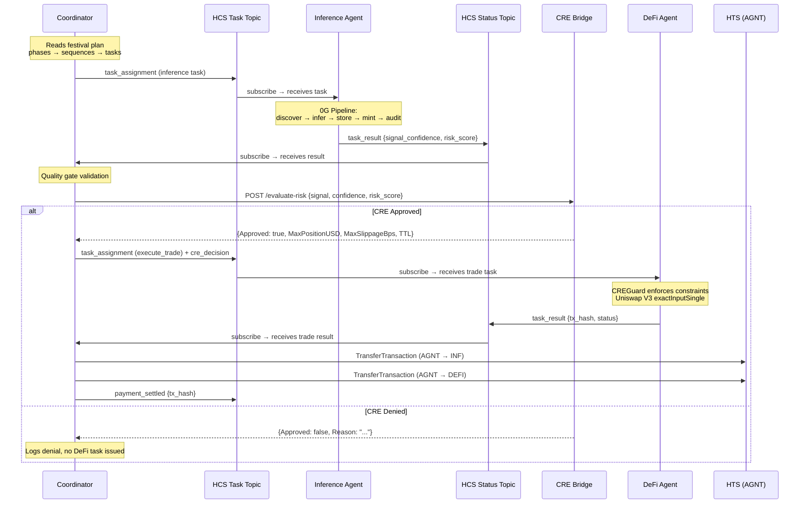
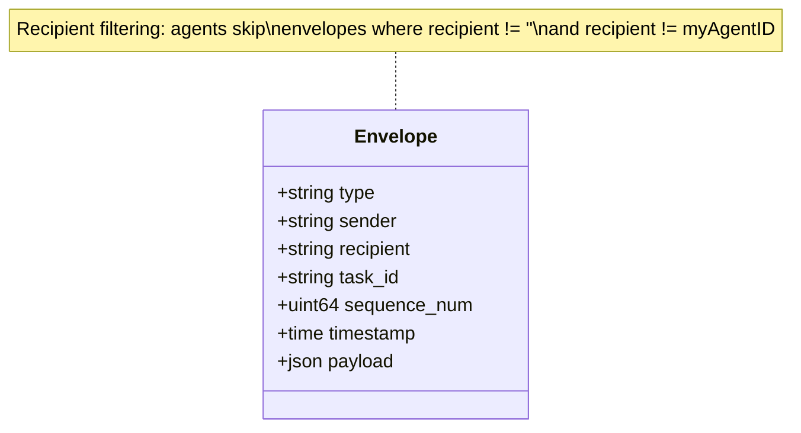
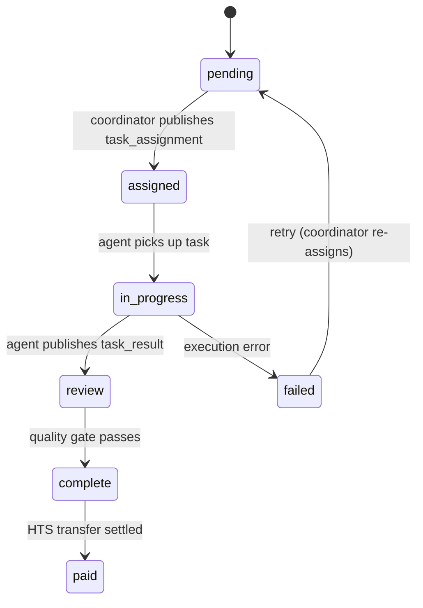

# Message Flow

The full task lifecycle as agents coordinate over Hedera Consensus Service, from task assignment through inference, risk evaluation, DeFi execution, and payment settlement.

## Task Lifecycle Sequence

## Envelope Wire Format

All agents serialize JSON `Envelope` structs to HCS topics:

### Message Types

| Type | Publisher | Subscriber | Topic |
|------|-----------|------------|-------|
| `task_assignment` | Coordinator | Inference, DeFi | Task |
| `task_result` | Inference, DeFi | Coordinator | Status |
| `status_update` | Inference, DeFi | Coordinator | Status |
| `heartbeat` | Inference, DeFi | Coordinator | Status |
| `pnl_report` | DeFi | Coordinator | Status |
| `quality_gate` | Coordinator | — | Task |
| `payment_settled` | Coordinator | — | Task |
| `risk_check_requested` | Coordinator | CRE | Task |
| `risk_check_approved` | CRE | Coordinator | Task |
| `risk_check_denied` | CRE | Coordinator | Task |

## Task State Machine

## See Also

- [System Overview](./01-system-overview.md) — full system topology
- [CRE Risk Pipeline](./04-cre-risk-pipeline.md) — detailed 8-gate evaluation
- [Chain Integration](./03-chain-integration.md) — which components touch which chains
