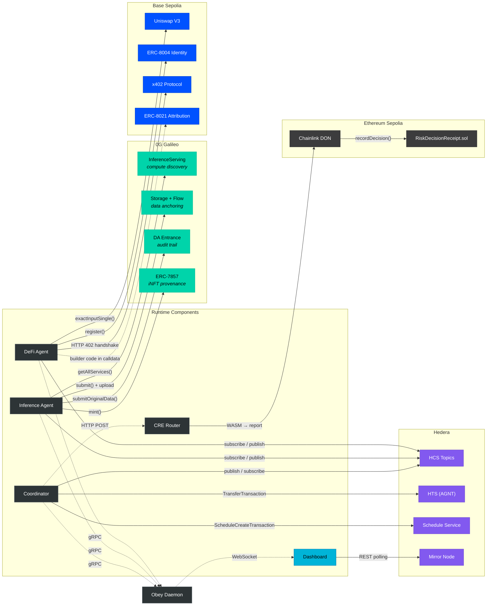

# Chain Integration Map

Which runtime components interact with which blockchain services. Left side: agents and services. Right side: chain-specific resources grouped by network.

## Chain Summary

| Chain | ID | Services Used | Accessed By |
|-------|----|---------------|-------------|
| **Hedera Testnet** | — | HCS, HTS, Schedule Service, Mirror Node | All agents + Dashboard |
| **0G Galileo** | 16602 | InferenceServing, Flow, DA Entrance, ERC-7857 | Inference Agent |
| **Base Sepolia** | 84532 | Uniswap V3, ERC-8004, x402, ERC-8021 | DeFi Agent |
| **Ethereum Sepolia** | 11155111 | RiskDecisionReceipt.sol, Chainlink DON | CRE Router |

## Off-Chain Connections

| From | To | Protocol | Purpose |
|------|----|----------|---------|
| Coordinator | CRE Bridge | HTTP POST | Risk evaluation before DeFi task assignment |
| All Agents | Obey Daemon | gRPC (port 50051) | Registration, heartbeat, command execution |
| Daemon | Dashboard | WebSocket (port 8080) | Real-time event stream |

## See Also

- [System Overview](./01-system-overview.md) — full system topology
- [CRE Risk Pipeline](./04-cre-risk-pipeline.md) — Chainlink CRE details
- [Docker Compose](./06-docker-compose.md) — how services connect in containers
