# CRE Risk Pipeline

End-to-end flow from inference result through the 8-gate CRE Risk Router to constrained DeFi execution, with parallel on-chain receipt writing via Chainlink DON consensus.

```mermaid
flowchart TD
    subgraph Entry["Signal Entry"]
        INF_RESULT["Inference Agent<br/><i>task_result</i>"]
        FIELDS["signal_confidence: 0.0-1.0<br/>risk_score: 0-100"]
    end

    INF_RESULT --> FIELDS
    FIELDS -->|"HCS Status Topic"| COORD["Coordinator"]
    COORD -->|"POST /evaluate-risk"| BRIDGE["CRE Bridge :8080"]

    subgraph CRE_GATES["CRE Risk Gates (sequential — first denial short-circuits)"]
        G7["Gate 7: Hold Filter<br/><i>reject hold signals</i>"]
        G1["Gate 1: Signal Confidence<br/><i>≥ 0.6 threshold</i>"]
        G2["Gate 2: Risk Score Ceiling<br/><i>≤ 75 maximum</i>"]
        G3["Gate 3: Signal Staleness<br/><i>≤ 300s TTL</i>"]
        G4["Gate 4: Oracle Health<br/><i>Chainlink latestRoundData</i>"]
        G5["Gate 5: Price Deviation<br/><i>≤ 500 BPS market vs oracle</i>"]
        G6["Gate 6: Position Sizing<br/><i>volatility + risk scaling</i>"]
        G8["Gate 8: Heartbeat Breaker<br/><i>agent liveness check</i>"]

        G7 --> G1 --> G2 --> G3 --> G4 --> G5 --> G6 --> G8
    end

    BRIDGE --> G7

    G8 --> DECISION{RiskDecision}

    DECISION -->|"Approved"| APPROVED["Constraints:<br/>MaxPositionUSD<br/>MaxSlippageBps<br/>TTL: 300s"]
    DECISION -->|"Denied"| DENIED["Denial Reason logged"]

    %% Approved path → DeFi execution
    APPROVED --> COORD_ASSIGN["Coordinator assigns<br/>execute_trade + cre_decision"]
    COORD_ASSIGN -->|"HCS Task Topic"| DEFI["DeFi Agent"]

    subgraph DeFi_Exec["DeFi Execution"]
        GUARD["CREGuard<br/><i>enforces constraints</i>"]
        CLAMP["Position clamped to<br/>MaxPositionUSD"]
        SLIP["Slippage enforced at<br/>MaxSlippageBps"]
        SWAP["Uniswap V3<br/>exactInputSingle()"]

        GUARD --> CLAMP --> SLIP --> SWAP
    end

    DEFI --> GUARD

    SWAP -->|"task_result + tx_hash"| HCS_OUT["HCS Status Topic"]

    %% Denied path
    DENIED --> COORD_LOG["Coordinator logs denial<br/><i>no DeFi task issued</i>"]

    %% Parallel: WASM → DON → on-chain receipt
    subgraph OnChain["On-Chain Receipt (parallel)"]
        WASM["WASM Binary<br/><i>wasip1 build</i>"]
        ABI["ABI Encode Decision"]
        REPORT["GenerateReport"]
        DON["DON Consensus"]
        RECEIPT["RiskDecisionReceipt.sol<br/><i>Ethereum Sepolia</i>"]
    end

    DECISION --> WASM
    WASM --> ABI --> REPORT --> DON --> RECEIPT

    %% Styles
    classDef hedera fill:#8259EF,color:#fff,stroke:#6b48cc
    classDef zerog fill:#00D4AA,color:#000,stroke:#00b894
    classDef base fill:#0052FF,color:#fff,stroke:#003ecc
    classDef ethereum fill:#3C3C3D,color:#fff,stroke:#2a2a2a
    classDef runtime fill:#2d3436,color:#fff,stroke:#636e72
    classDef gate fill:#374151,color:#fff,stroke:#4b5563
    classDef approved fill:#059669,color:#fff,stroke:#047857
    classDef denied fill:#dc2626,color:#fff,stroke:#b91c1c

    class COORD,BRIDGE,COORD_ASSIGN,COORD_LOG runtime
    class INF_RESULT,FIELDS zerog
    class DEFI,GUARD,CLAMP,SLIP,SWAP base
    class WASM,ABI,REPORT,DON,RECEIPT ethereum
    class HCS_OUT hedera
    class G7,G1,G2,G3,G4,G5,G6,G8 gate
    class APPROVED approved
    class DENIED denied
```

## Gate Configuration

Thresholds from `config.staging.json`:

| Gate | Parameter | Default | Effect |
|:----:|-----------|:-------:|--------|
| 7 | Hold signal filter | — | Fast-path deny for `hold` signals |
| 1 | `signal_confidence_threshold` | 0.6 | Deny if confidence < threshold |
| 2 | `max_risk_score` | 75 | Deny if risk score > maximum |
| 3 | `decision_ttl_seconds` | 300 | Deny if signal older than TTL |
| 4 | `oracle_staleness_seconds` | 3600 | Deny if Chainlink feed is stale |
| 5 | `price_deviation_max_bps` | 500 | Deny if market-oracle divergence > 5% |
| 6 | `volatility_scale_factor` | 1.0 | Scale position by volatility and risk |
| 8 | `enable_heartbeat_gate` | false | Optional agent liveness circuit breaker |

## CREGuard Enforcement (DeFi Agent)

When the coordinator issues an `execute_trade` task with a `cre_decision` payload:

1. `cre_decision.approved` must be `true`
2. `decision_timestamp + ttl_seconds` must not be expired
3. `max_position_usd` is converted to base-asset units at current price, then hard-clamped
4. `max_slippage_bps` is enforced per-trade
5. Autonomous/background cycles fall back to local strategy limits

## On-Chain Receipt

The CRE WASM binary runs in parallel:
1. Decision is ABI-encoded (raw payload, no function selector)
2. `GenerateReport` creates a signed CRE report
3. DON consensus validates and co-signs
4. KeystoneForwarder (`0x15fC6ae953E024d975e77382eEeC56A9101f9F88`) calls `onReport(bytes,bytes)` on `RiskDecisionReceipt.sol` at [`0x9C7Aa5502ad229c80894E272Be6d697Fd02001d7`](https://sepolia.etherscan.io/address/0x9C7Aa5502ad229c80894E272Be6d697Fd02001d7) on Ethereum Sepolia
5. `onReport()` decodes the report payload and delegates to `_recordDecision()` for storage

The contract implements the CRE `IReceiver` interface and ERC165 for interface detection.

## See Also

- [Message Flow](./02-message-flow.md) — how CRE fits in the task lifecycle
- [Chain Integration](./03-chain-integration.md) — Ethereum Sepolia connections
- [System Overview](./01-system-overview.md) — where CRE sits in the full topology
