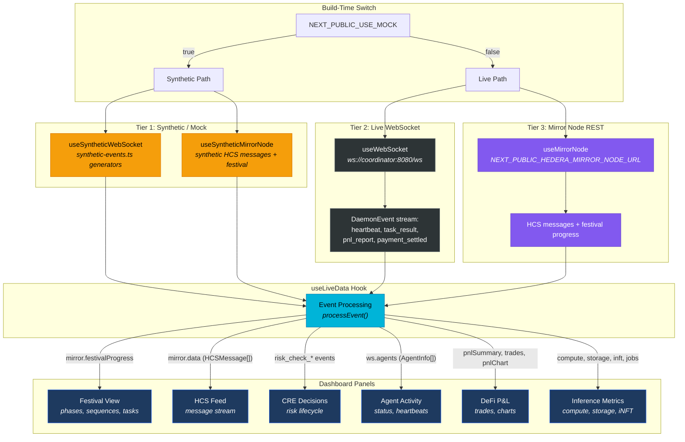

# Dashboard Data Flow

Three-tier data source architecture feeding six dashboard panels. The `useLiveData` hook selects between synthetic and live sources at build time via `NEXT_PUBLIC_USE_MOCK`.

## Data Source Priority

| Source | Panels Fed | Requires |
|--------|-----------|----------|
| **Synthetic** (Tier 1) | All 6 panels | `NEXT_PUBLIC_USE_MOCK=true` only |
| **WebSocket** (Tier 2) | Agent Activity, DeFi P&L, Inference Metrics, CRE Decisions | Live coordinator + daemon |
| **Mirror Node** (Tier 3) | Festival View, HCS Feed | Hedera testnet access |

## Panel-Source Mapping

| Panel | Synthetic | WebSocket | Mirror Node |
|-------|:---------:|:---------:|:-----------:|
| Festival View | generateFestivalProgress() | — | festivalProgress |
| HCS Feed | eventToHCSMessage() | — | HCS polling |
| CRE Decisions | generateRiskCheck*() | risk_check_* events | — |
| Agent Activity | deriveAgents() | ws.agents | — |
| DeFi P&L | generateTradeResult() | task_result, pnl_report | — |
| Inference Metrics | generateInferenceResult() | heartbeat (compute/storage/inft) | — |

## Degradation

Without the live daemon/coordinator running, panels degrade as follows:

- **Festival View** and **HCS Feed** continue working via Mirror Node REST
- **Agent Activity**, **DeFi P&L**, **Inference Metrics**, and **CRE Decisions** require the WebSocket connection and show empty/stale state without it
- **Synthetic mode** provides full demo coverage for all panels without any external dependencies

## See Also

- [System Overview](./01-system-overview.md) — where the dashboard fits in the topology
- [Docker Compose](./06-docker-compose.md) — running the dashboard in containers
- [Message Flow](./02-message-flow.md) — event types the dashboard consumes
