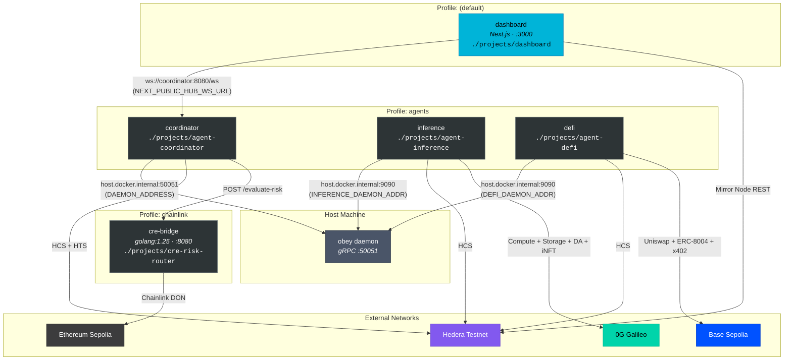

# Docker Compose Topology

Five services across three Docker Compose profiles. The dashboard runs by default; agents and CRE bridge require explicit profile activation.

## Service Matrix

| Service | Profile | Port | Build Context | Image |
|---------|---------|------|---------------|-------|
| `dashboard` | (default) | 3000:3000 | `./projects/dashboard` | Dockerfile |
| `coordinator` | `agents` | — | `./projects/agent-coordinator` | Dockerfile |
| `inference` | `agents` | — | `./projects/agent-inference` | Dockerfile |
| `defi` | `agents` | — | `./projects/agent-defi` | Dockerfile |
| `cre-bridge` | `chainlink` | 8080:8080 | volume mount | `golang:1.25` |

## Profile Combinations

| Command | Services Started | Use Case |
|---------|-----------------|----------|
| `just demo up` | dashboard | Demo mode with synthetic data |
| `docker compose up` | dashboard | Same as above |
| `docker compose --profile agents up` | dashboard + coordinator + inference + defi | Live agents without CRE |
| `docker compose --profile agents --profile chainlink up` | All 5 services | Full system |

## Key Environment Variables

| Service | Variable | Default | Purpose |
|---------|----------|---------|---------|
| dashboard | `NEXT_PUBLIC_USE_MOCK` | `true` | Enable synthetic data mode |
| dashboard | `NEXT_PUBLIC_HUB_WS_URL` | `ws://coordinator:8080/ws` | WebSocket to coordinator |
| dashboard | `NEXT_PUBLIC_HEDERA_MIRROR_NODE_URL` | `https://testnet.mirrornode.hedera.com` | Mirror Node REST |
| coordinator | `DAEMON_ADDRESS` | `host.docker.internal:50051` | Daemon gRPC on host |
| coordinator | `CRE_ENDPOINT` | — | CRE bridge HTTP endpoint |
| inference | `INFERENCE_DAEMON_ADDR` | `host.docker.internal:9090` | Daemon gRPC on host |
| inference | `ZG_CHAIN_RPC` | `https://evmrpc-testnet.0g.ai` | 0G Galileo RPC |
| defi | `DEFI_DAEMON_ADDR` | `host.docker.internal:9090` | Daemon gRPC on host |
| defi | `DEFI_BASE_RPC_URL` | `https://sepolia.base.org` | Base Sepolia RPC |
| cre-bridge | `BRIDGE_ADDR` | `:8080` | Bridge listen address |

## Host Bridge

All agent containers use `extra_hosts: ["host.docker.internal:host-gateway"]` to reach the obey daemon running on the host machine. If no daemon is running, agents degrade gracefully via `NoopClient`.

## Health Checks

All services include health checks:
- **dashboard**: `wget --spider http://127.0.0.1:3000` (10s interval)
- **coordinator**: `pgrep -x coordinator` (10s interval)
- **inference**: `pgrep -x agent-inference` (10s interval)
- **defi**: `pgrep -x agent-defi` (10s interval)

## See Also

- [System Overview](./01-system-overview.md) — logical topology
- [Dashboard Data Flow](./05-dashboard-data-flow.md) — how the dashboard consumes data
- [Chain Integration](./03-chain-integration.md) — what external networks each service calls
