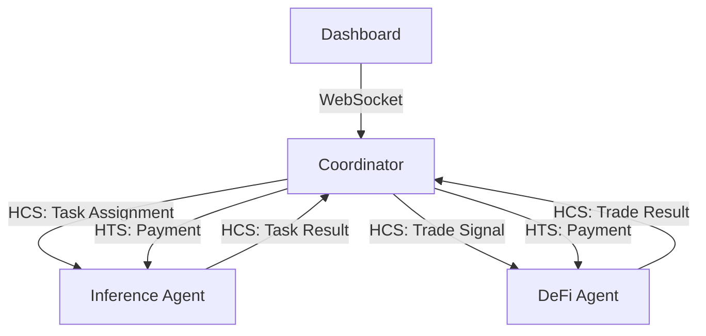

# Task: Polish Agent-Coordinator README

**Task Number:** 01 | **Sequence:** 02_hedera_track3_package | **Autonomy:** medium

## Objective

Polish the agent-coordinator `README.md` to serve as the primary submission document for the Hedera Track 3 ($5k) bounty. The README must include a project overview, architecture diagram, setup instructions, demo walkthrough, and a bounty alignment section that explicitly maps features to Hedera Track 3 requirements.

## Requirements

- [ ] Project overview section explaining what the agent-coordinator does
- [ ] Architecture diagram (ASCII or Mermaid) showing agent communication via HCS and payments via HTS
- [ ] Setup instructions that a judge can follow to run the project locally
- [ ] Demo walkthrough section describing what the demo video shows
- [ ] Bounty alignment section mapping features to Hedera Track 3 requirements
- [ ] All links are valid and resolve correctly
- [ ] README is saved at the project root: `projects/agent-coordinator/README.md`

## Implementation

### Step 1: Read the existing README

Navigate to the agent-coordinator project and read the current README:

```bash
cd $(fgo) && cat README.md
```

Note what exists and what is missing against the requirements above.

### Step 2: Write the project overview

The overview should answer these questions in 3-5 sentences:

- What is agent-coordinator?
- What problem does it solve?
- What Hedera services does it use (HCS for messaging, HTS for payments)?
- How does it fit into the larger multi-agent economy?

### Step 3: Create the architecture diagram

Add an architecture diagram showing:

- The coordinator agent at the center
- Inference agent and DeFi agent as connected nodes
- HCS topics as communication channels between agents
- HTS token transfers as payment flows
- The dashboard as an observer

Use Mermaid format for maintainability:



### Step 4: Write setup instructions

Include step-by-step setup instructions:

1. Prerequisites (Go version, Hedera testnet account, environment setup)
2. Clone and install dependencies
3. Configure environment variables (list all required vars with descriptions)
4. Build the project
5. Run the coordinator
6. Verify it is working (what output to expect)

Every command must be copy-pasteable. Test each command yourself.

### Step 5: Write the demo walkthrough

Describe what the demo video shows, section by section, so a judge who cannot watch the video can still understand the system. Reference the demo video URL (to be filled after recording).

### Step 6: Write the bounty alignment section

Create a section titled "Hedera Track 3 Alignment" that maps project features to bounty requirements:

| Bounty Requirement | How This Project Meets It |
|-------------------|---------------------------|
| Native Hedera services | HCS for agent messaging, HTS for payments |
| Agent coordination | Coordinator manages task lifecycle across agents |
| [additional requirements] | [additional mappings] |

Pull the exact bounty requirements from the ETHDenver submission portal and map each one.

### Step 7: Review all links

Check every link in the README resolves correctly:

- Internal anchor links (sections within the README)
- External links (documentation, demo video, block explorer)
- Relative links (other docs in the repo)

## Done When

- [ ] README has all six required sections (overview, diagram, setup, demo, bounty alignment, links)
- [ ] Architecture diagram renders correctly in GitHub markdown
- [ ] Setup instructions tested and reproducible
- [ ] Bounty alignment explicitly references Hedera Track 3 requirements
- [ ] All links verified valid
- [ ] README saved at `projects/agent-coordinator/README.md`
