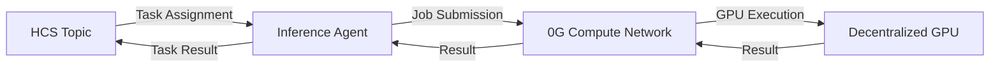

# Task: Polish Agent-Inference README

**Task Number:** 02 | **Sequence:** 03_zerog_track2_package | **Autonomy:** medium

## Objective

Polish the agent-inference `README.md` to serve as the primary submission document for the 0G Track 2 ($7k) bounty. Focus on 0G Compute integration, the inference pipeline, and decentralized GPU usage. Include a bounty alignment section for 0G Track 2.

## Requirements

- [ ] Project overview explaining the inference agent and its 0G Compute integration
- [ ] Architecture diagram showing the inference pipeline (request, 0G routing, GPU execution, result delivery)
- [ ] Setup instructions including 0G Compute prerequisites
- [ ] Usage examples showing how to trigger inference and see results
- [ ] Bounty alignment section mapping features to 0G Track 2 requirements
- [ ] README saved at `projects/agent-inference/README.md`

## Implementation

### Step 1: Read the existing README

```bash
cd $(fgo) && cat README.md
```

Note what exists and what gaps need filling.

### Step 2: Write the project overview

Explain:

- What the inference agent does (receives tasks from coordinator, executes ML inference via 0G Compute, returns results)
- Why decentralized GPU inference matters (censorship resistance, cost efficiency, no single-provider lock-in)
- How 0G Compute is integrated (SDK usage, compute network selection, job submission)

### Step 3: Create the architecture diagram

Show the inference pipeline:



### Step 4: Write setup instructions

Include:

1. Prerequisites (Go version, 0G SDK, Hedera testnet credentials)
2. 0G Compute configuration (endpoint, API key if needed, network selection)
3. Build and run commands
4. How to verify inference is working

### Step 5: Write the bounty alignment section

Map project features to 0G Track 2 requirements:

| 0G Track 2 Requirement | How This Project Meets It |
|------------------------|---------------------------|
| Decentralized GPU usage | Inference jobs submitted to 0G Compute Network |
| [additional requirements] | [additional mappings] |

### Step 6: Verify all links

Check every link resolves correctly.

## Done When

- [ ] README has all required sections (overview, diagram, setup, usage, bounty alignment)
- [ ] 0G Compute integration is prominently featured
- [ ] Setup instructions are tested and reproducible
- [ ] Bounty alignment explicitly references 0G Track 2 requirements
- [ ] All links verified valid
