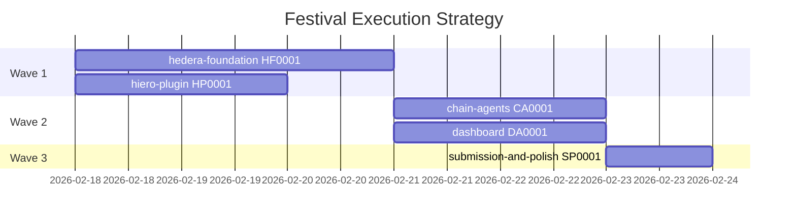

# Festival Execution Strategy

Dependency analysis and execution order for the 5 ETHDenver 2026 campaign festivals.

## Festival Inventory

| Festival | ID | Project(s) | Sequences | Tasks |
|----------|----|------------|-----------|-------|
| hedera-foundation | HF0001 | agent-coordinator | 6 | 47 |
| chain-agents | CA0001 | agent-inference, agent-defi, agent-coordinator | 3 | 36 |
| hiero-plugin | HP0001 | hiero-plugin | 4 | 33 |
| dashboard | DA0001 | dashboard | 7 | 51 |
| submission-and-polish | SP0001 | cross-project | 10 | 84 |
| **Total** | | | **30** | **251** |

## Dependency Chain

```
                    ┌───────────────────────────────┐
                    │      hedera-foundation         │
                    │      HF0001                    │
                    │                                │
                    │  HCS topics, HTS tokens,       │
                    │  Schedule Service, coordinator  │
                    │  engine, daemon client pkg      │
                    │                                │
                    │  Project: agent-coordinator     │
                    └──────────┬────────────────────┘
                               │
                               │ chain-agents and dashboard
                               │ depend on HCS/HTS/coordinator
                               │
              ┌────────────────┼───────────────────┐
              │                │                    │
              ▼                ▼                    │
┌─────────────────────┐ ┌──────────────────┐       │
│   chain-agents       │ │   dashboard       │       │
│   CA0001             │ │   DA0001          │       │
│                      │ │                   │       │
│ Inference agent (0G) │ │ Observer UI with  │       │
│ DeFi agent (Base)    │ │ 5 panels, data    │       │
│ Integration verify   │ │ layer, demo       │       │
│                      │ │ polish            │       │
│ Projects:            │ │                   │       │
│  agent-inference     │ │ Project:          │       │
│  agent-defi          │ │  dashboard        │       │
│  agent-coordinator   │ │                   │       │
└──────────┬───────────┘ └────────┬──────────┘       │
           │                      │                  │
           └──────────┬───────────┘                  │
                      │                              │
                      ▼                              │
         ┌─────────────────────────┐                 │
         │  submission-and-polish   │                 │
         │  SP0001                  │                 │
         │                         │                 │
         │  E2E testing, per-track │                 │
         │  packaging, deployment, │                 │
         │  demo video, bounty     │                 │
         │  submissions            │                 │
         │                         │                 │
         │  Projects: ALL          │                 │
         └─────────────────────────┘                 │
                                                     │
                                                     │
         ┌─────────────────────────┐                 │
         │   hiero-plugin          │ ◀───────────────┘
         │   HP0001                │   NO DEPENDENCY
         │                         │   (fully independent)
         │  Hiero CLI camp plugin  │
         │  Standalone Track 4     │
         │                         │
         │  Project: hiero-plugin  │
         └─────────────────────────┘
```

## Dependency Details

### hedera-foundation (HF0001) → chain-agents (CA0001)

**Type**: Hard dependency

The chain-agents festival explicitly states: "This phase depends on the hedera-foundation festival (HF0001) completing HCS messaging and HTS payment infrastructure." Both the inference and DeFi agents subscribe to HCS for task assignments and publish results back to the coordinator. The coordinator engine, daemon client package, and HTS payment flow are all built in hedera-foundation.

**Specific dependencies**:
- `internal/hedera/hcs/` — agents need HCS topic subscribe/publish
- `internal/hedera/hts/` — agents need HTS for payment settlement
- `internal/daemon/client/` — shared consumer package for daemon API
- Coordinator engine — assigns tasks to agents via HCS

### hedera-foundation (HF0001) → dashboard (DA0001)

**Type**: Soft dependency (can start with mocks)

The dashboard connects to daemon hub WebSocket and Hedera mirror node REST API to display live data. The dashboard phase notes: "Dependencies: chain-agents festival must be active for live agent data; hedera-foundation festival must be active for HCS/HTS data. Development can proceed with mock data."

**Specific dependencies**:
- HCS feed panel needs HCS topics to exist and have messages
- Festival view panel needs daemon state API with festival data
- Agent activity panel needs running agents reporting to daemon
- Data can be mocked for early development; live data requires hedera-foundation

**Practical implication**: Dashboard sequences 01-03 (data layer, festival view, HCS feed) can start with mock data in parallel with hedera-foundation. Sequences 04-07 (agent activity, DeFi P&L, inference metrics, demo polish) need real agent data from chain-agents.

### chain-agents (CA0001) + dashboard (DA0001) → submission-and-polish (SP0001)

**Type**: Hard dependency

Submission-and-polish phase 003_EXECUTE explicitly states: "Festivals 1-4 (chain-agents, dashboard, hedera-foundation, hiero-plugin) must be complete." This festival runs E2E testing, packages bounty submissions, deploys to testnet, and records the demo video. All of that requires working code from the other festivals.

### hiero-plugin (HP0001) → NONE

**Type**: Fully independent

The hiero-plugin festival notes: "No external festival dependencies; this can proceed fully in parallel with all other festivals." It wraps the camp binary for Hiero CLI and targets Track 4 independently.

## Execution Waves

### Wave 1: Foundation + Independent (parallel)

```
┌──────────────────────────────────────────────────────────────┐
│ WAVE 1 — Start immediately, run in parallel                  │
│                                                              │
│  ┌─────────────────────────┐  ┌─────────────────────────┐   │
│  │ hedera-foundation       │  │ hiero-plugin             │   │
│  │ HF0001                  │  │ HP0001                   │   │
│  │                         │  │                          │   │
│  │ 6 sequences, 47 tasks   │  │ 4 sequences, 33 tasks   │   │
│  │ agent-coordinator proj  │  │ hiero-plugin proj        │   │
│  └─────────────────────────┘  └─────────────────────────┘   │
│                                                              │
│  Optional: dashboard DA0001 sequences 01-03 can start with  │
│  mock data (data layer, festival view, HCS feed scaffolds)   │
└──────────────────────────────────────────────────────────────┘
```

**Gate**: hedera-foundation HF0001 quality gates pass → Wave 2 unblocked

### Wave 2: Agents + Dashboard (parallel)

```
┌──────────────────────────────────────────────────────────────┐
│ WAVE 2 — Starts when hedera-foundation gates pass            │
│                                                              │
│  ┌─────────────────────────┐  ┌─────────────────────────┐   │
│  │ chain-agents            │  │ dashboard                │   │
│  │ CA0001                  │  │ DA0001                   │   │
│  │                         │  │                          │   │
│  │ 3 sequences, 36 tasks   │  │ 7 sequences, 51 tasks   │   │
│  │ agent-inference proj    │  │ dashboard proj           │   │
│  │ agent-defi proj         │  │                          │   │
│  │ agent-coordinator proj  │  │ Can use mock data early, │   │
│  │                         │  │ switch to live data as   │   │
│  │ inference + defi seqs   │  │ agents come online       │   │
│  │ can run in parallel     │  │                          │   │
│  └─────────────────────────┘  └─────────────────────────┘   │
│                                                              │
│  hiero-plugin HP0001 may still be running or already done    │
└──────────────────────────────────────────────────────────────┘
```

**Gate**: chain-agents + dashboard + hiero-plugin quality gates all pass → Wave 3 unblocked

### Wave 3: Final Assembly

```
┌──────────────────────────────────────────────────────────────┐
│ WAVE 3 — Starts when ALL other festivals complete            │
│                                                              │
│  ┌──────────────────────────────────────────────────────┐   │
│  │ submission-and-polish                                 │   │
│  │ SP0001                                                │   │
│  │                                                       │   │
│  │ 10 sequences, 84 tasks                                │   │
│  │ ALL projects                                          │   │
│  │                                                       │   │
│  │ E2E testing → per-track packaging → deploy → demo     │   │
│  └──────────────────────────────────────────────────────┘   │
└──────────────────────────────────────────────────────────────┘
```

## Mermaid: Execution Timeline



## Parallel Execution Within Festivals

Some festivals have internal parallelism at the sequence level:

### chain-agents (CA0001)

Sequences `01_inference_0g` and `02_defi_base` target different projects (agent-inference and agent-defi) and have no cross-dependency. They can run in parallel. Sequence `03_integration_verify` depends on both completing.

```
01_inference_0g ──┐
                  ├──▶ 03_integration_verify
02_defi_base ─────┘
```

### dashboard (DA0001)

Sequences must be mostly serial — `01_data_layer` must complete first (provides connectors), then panels 02-06 could theoretically run in parallel since they're independent components, though they all target the same project. Sequence `07_demo_polish` depends on all panels.

```
01_data_layer ──▶ 02-06 (panels, serial or parallel) ──▶ 07_demo_polish
```

### hedera-foundation (HF0001)

Sequences 01-03 (HCS, HTS, Schedule) are independent services and could run in parallel. Sequence 04 (coordinator) depends on all three. Sequence 05 (daemon client) is independent. Sequence 06 (integration) depends on all.

```
01_hcs_service ────┐
02_hts_service ────┼──▶ 04_coordinator ──┐
03_schedule_service┘                     ├──▶ 06_integration
05_daemon_client ────────────────────────┘
```

## Agent Assignment Strategy

When assigning festivals to agents (obey sessions), consider:

| Festival | Recommended Agents | Rationale |
|----------|--------------------|-----------|
| hedera-foundation | 1 agent | Sequential sequence dependencies, single project |
| chain-agents | 2 agents (1 per specialist agent) | inference and defi sequences are independent |
| hiero-plugin | 1 agent | Small scope, single project, independent |
| dashboard | 1 agent | Single project, sequential panel builds |
| submission-and-polish | 1-2 agents | Cross-project but mostly serial |

**Maximum useful parallelism**: 4 agents (1 hedera + 1 hiero + 1 inference + 1 defi), later dropping to 3-4 as festivals complete.

## Risk Factors

| Risk | Impact | Mitigation |
|------|--------|------------|
| Hedera testnet instability | Blocks HF0001 → blocks CA0001 | Use recorded testnet data for development; live testnet for integration only |
| 0G SDK TypeScript-only | Blocks inference agent Go implementation | Go wrapper or TypeScript agent with Go orchestration |
| Dashboard mock→live data transition | Late integration bugs in DA0001 | Start with realistic mocks matching actual event schemas |
| Submission festival scope creep | SP0001 takes longer than expected | Strict no-new-features rule; fix-only during submission |
| Single project contention | Two agents editing same files | Festival methodology enforces one-project-per-sequence |
