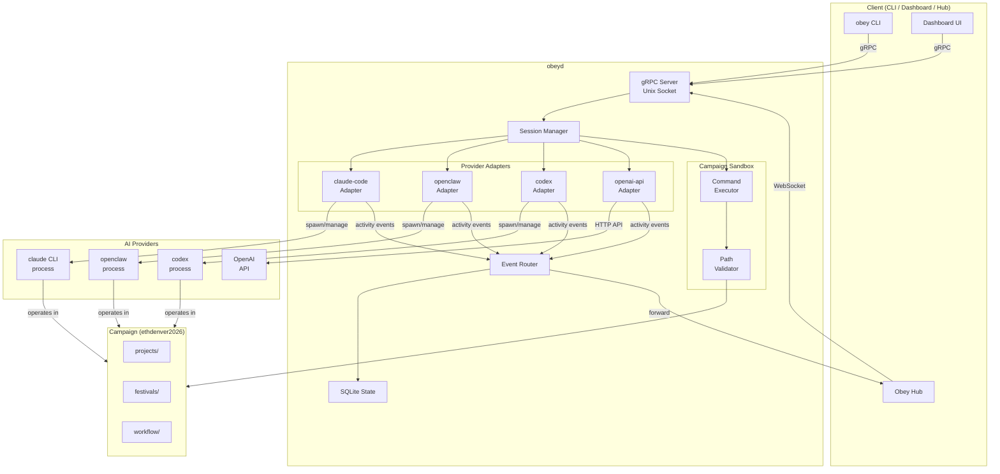

# 01 — Agent Session Architecture

## Overview

An **agent session** is the core unit of work in obeyd. It represents a single AI agent execution context — a running instance of a provider (claude-code, openclaw, codex, openai-api) that is scoped to a campaign and can perform work within that campaign's sandbox.

Sessions are **provider-agnostic**. The daemon doesn't care which AI provider powers the session. It manages the lifecycle (create → run → stop), enforces sandbox boundaries, streams activity events, and tracks token usage. The provider adapter handles the specifics of communicating with each AI backend.

## Core Concepts

### Session Model

```
┌─────────────────────────────────────────────────────────────────┐
│                        AGENT SESSION                             │
│                                                                  │
│  ID:         "sess_abc123"                                       │
│  Campaign:   "ethdenver2026"     ← bound at creation, immutable  │
│  Provider:   "claude-code"       ← selected at creation          │
│  Model:      "opus"              ← provider-specific config      │
│  Status:     "running"           ← managed by daemon             │
│  WorkDir:    "/path/to/campaign" ← sandbox root                  │
│                                                                  │
│  ┌─────────────────────────────────────────────────────────┐     │
│  │              PROVIDER ADAPTER (claude-code)              │     │
│  │                                                         │     │
│  │  Manages actual AI process/connection                   │     │
│  │  Translates daemon commands → provider protocol         │     │
│  │  Streams activity events back to daemon                 │     │
│  └─────────────────────────────────────────────────────────┘     │
│                                                                  │
│  ┌─────────────────────────────────────────────────────────┐     │
│  │              CAMPAIGN SANDBOX                            │     │
│  │                                                         │     │
│  │  Root: /home/user/campaigns/ethdenver2026               │     │
│  │  Allowed commands: fest, camp, just, git + custom       │     │
│  │  Path enforcement: all file access within root          │     │
│  │  Env filtering: OBEY_* namespace reserved               │     │
│  └─────────────────────────────────────────────────────────┘     │
│                                                                  │
└─────────────────────────────────────────────────────────────────┘
```

### Session ≠ Agent Definition

The existing daemon docs describe an **agent registry** (permanent agent definitions like "coordinator", "inference-agent"). Sessions are different:

| Concept | Agent Definition | Agent Session |
|---------|-----------------|---------------|
| Lifespan | Persistent | Ephemeral (one execution) |
| Scope | Registered in daemon | Bound to one campaign |
| Purpose | "What agents exist" | "What agents are running right now" |
| Provider | Fixed per definition | Selected per session |
| Example | "coordinator agent uses claude" | "session sess_abc is running claude-code in ethdenver2026" |

A session **may** reference an agent definition, but sessions can also be created ad-hoc without one. For the hackathon, ad-hoc sessions are sufficient.

### Campaign Scoping

Every session is bound to exactly one campaign at creation time. This is the fundamental security boundary:

```
Campaign: ethdenver2026
├── projects/agent-coordinator/     ✅ Session can access
├── projects/agent-inference/       ✅ Session can access
├── projects/dashboard/             ✅ Session can access
├── festivals/                      ✅ Session can access
├── workflow/                       ✅ Session can access
└── .env                            ❌ Filtered (sensitive)

Campaign: other-project
├── anything/                       ❌ Session CANNOT access
```

Campaign scoping is enforced at multiple levels:
1. **Working directory** — session process starts in campaign root
2. **Command sandbox** — all commands validated against campaign boundary
3. **Path resolution** — symlinks resolved before boundary check
4. **Environment** — OBEY_* vars injected, campaign context provided

## Session Lifecycle

### State Machine

```
                    CreateSession()
                         │
                         ▼
                   ┌──────────┐
                   │ CREATED  │
                   └────┬─────┘
                        │ (provider adapter initializes)
                        ▼
                   ┌──────────┐
          ┌───────│ STARTING │
          │       └────┬─────┘
          │            │ (provider ready, process running)
          │            ▼
          │       ┌──────────┐
          │  ┌───▶│ RUNNING  │◀──────────────────┐
          │  │    └──┬───┬───┘                    │
          │  │       │   │                        │
          │  │       │   │ SendMessage()           │
          │  │       │   ▼                        │
          │  │       │ ┌──────────┐               │
          │  │       │ │ WORKING  │──(idle)───────┘
          │  │       │ └──────────┘
          │  │       │
          │  │       │ StopSession()
          │  │       ▼
          │  │  ┌──────────┐
          │  │  │ STOPPING │
          │  │  └────┬─────┘
          │  │       │ (graceful shutdown)
          │  │       ▼
          │  │  ┌──────────┐
          │  └──│ STOPPED  │ (terminal — can restart)
          │     └──────────┘
          │
          │ (init failure / crash)
          ▼
     ┌──────────┐
     │  FAILED  │ (terminal — needs investigation)
     └──────────┘
```

### Lifecycle Detail

#### 1. Create

```
Client → CreateSession(campaign_id, provider, model, config)
  │
  ├── Validate campaign exists and is registered
  ├── Validate provider is supported
  ├── Generate session ID (ulid)
  ├── Insert into agent_sessions table (status: CREATED)
  ├── Initialize provider adapter
  └── Return SessionInfo { id, status: CREATED }
```

#### 2. Start (automatic after create, or explicit restart)

```
Daemon → ProviderAdapter.Start(session_config)
  │
  ├── Provider-specific initialization:
  │   ├── claude-code: spawn `claude` CLI process
  │   ├── openclaw: spawn openclaw process
  │   ├── codex: spawn codex process
  │   └── openai-api: initialize API client + REPL loop
  │
  ├── Set working directory to campaign root
  ├── Inject environment variables
  ├── Begin activity streaming
  ├── Update status → RUNNING
  └── Emit SESSION_STARTED event
```

#### 3. Send Message (interact with running session)

```
Client → SendMessage(session_id, message)
  │
  ├── Validate session is RUNNING
  ├── Route message to provider adapter
  │   ├── claude-code: pipe to stdin
  │   ├── openclaw: send via API
  │   ├── codex: send via API
  │   └── openai-api: send via chat completion
  │
  ├── Update status → WORKING
  ├── Stream activity events (thinking, tool_calls, results)
  ├── When idle → status → RUNNING
  └── Return response stream
```

#### 4. Stop

```
Client → StopSession(session_id, graceful=true)
  │
  ├── Update status → STOPPING
  ├── Provider-specific shutdown:
  │   ├── claude-code: send /exit, then SIGTERM, then SIGKILL
  │   ├── openclaw: send stop command, then SIGTERM
  │   ├── codex: send stop command, then SIGTERM
  │   └── openai-api: close connection, cancel pending requests
  │
  ├── Flush activity buffer
  ├── Record final token counts
  ├── Update status → STOPPED
  └── Emit SESSION_STOPPED event
```

## Session Data Model

### Existing Table (agent_sessions) — Enhanced

The existing `agent_sessions` table in obeyd's SQLite schema already captures most of what we need. Enhancements:

```sql
-- Existing columns (keep as-is)
id TEXT PRIMARY KEY,           -- ULID
campaign_id TEXT NOT NULL,     -- FK → campaigns(id)
festival_id TEXT,              -- Optional: if session is working a festival
task_id TEXT,                  -- Optional: if session is on a specific task
agent_name TEXT,               -- Human-readable name
provider TEXT NOT NULL,        -- "claude-code", "openclaw", "codex", "openai-api"
model TEXT,                    -- Provider-specific model ID
status TEXT NOT NULL,          -- CREATED, STARTING, RUNNING, WORKING, STOPPING, STOPPED, FAILED
tokens_input INTEGER DEFAULT 0,
tokens_output INTEGER DEFAULT 0,
working_dir TEXT NOT NULL,     -- Campaign root path
started_at TIMESTAMP,
ended_at TIMESTAMP,

-- New columns needed
config_json TEXT,              -- Provider-specific config (JSON)
pid INTEGER,                   -- OS process ID (for process-based providers)
last_activity_at TIMESTAMP,    -- Last activity event timestamp
error_message TEXT,            -- If FAILED, why
restart_count INTEGER DEFAULT 0,
parent_session_id TEXT,        -- If this session was spawned by another session

FOREIGN KEY (campaign_id) REFERENCES campaigns(id)
```

### Activity Events (agent_activities) — No Changes

The existing `agent_activities` table already supports:
- `AGENT_THINKING` — model is reasoning
- `AGENT_TOOL_CALL` — model invoked a tool
- `AGENT_TOOL_RESULT` — tool returned a result
- `AGENT_COMPLETION` — model produced final output

These activity types cover the universal agent activity model across all providers.

## Architecture Diagram (Mermaid)



## Architecture Diagram (ASCII)

```
┌─────────────────────────────────────────────────────────────────────────┐
│                              CLIENTS                                     │
│                                                                         │
│   obey CLI          Dashboard           Obey Hub (future)               │
│      │                  │                    │                           │
│      └──────────────────┼────────────────────┘                          │
│                         │                                               │
│                    gRPC / WebSocket                                      │
└─────────────────────────┼───────────────────────────────────────────────┘
                          │
┌─────────────────────────┼───────────────────────────────────────────────┐
│                      obeyd                                               │
│                         │                                               │
│              ┌──────────▼──────────┐                                    │
│              │   gRPC Server       │                                    │
│              │   (Unix Socket)     │                                    │
│              └──────────┬──────────┘                                    │
│                         │                                               │
│              ┌──────────▼──────────┐                                    │
│              │  Session Manager    │                                    │
│              │                     │                                    │
│              │  - Create/Stop      │                                    │
│              │  - Route messages   │                                    │
│              │  - Track lifecycle  │                                    │
│              └──┬───┬───┬───┬─────┘                                    │
│                 │   │   │   │                                           │
│    ┌────────────┘   │   │   └────────────┐                             │
│    ▼                ▼   ▼                ▼                              │
│ ┌────────┐  ┌────────┐ ┌────────┐  ┌────────┐                         │
│ │claude- │  │open-   │ │codex   │  │openai- │   Provider               │
│ │code    │  │claw    │ │adapter │  │api     │   Adapters               │
│ │adapter │  │adapter │ │        │  │adapter │                          │
│ └───┬────┘  └───┬────┘ └───┬────┘  └───┬────┘                         │
│     │           │          │           │                               │
│     │    ┌──────┴──────────┴───────────┘                               │
│     │    │                                                             │
│     │    │  Activity Events                                            │
│     │    ▼                                                             │
│     │  ┌──────────────────┐     ┌──────────────────┐                   │
│     │  │  Event Router    │────▶│  SQLite State     │                  │
│     │  │  (dedup + route) │     │  (agent_sessions, │                  │
│     │  └────────┬─────────┘     │   agent_activities)│                 │
│     │           │               └──────────────────┘                   │
│     │           │ forward to hub                                       │
│     │           ▼                                                      │
│     │     [Hub WebSocket]                                              │
│     │                                                                  │
│     │  ┌──────────────────┐                                            │
│     └─▶│ Campaign Sandbox │                                            │
│        │                  │                                            │
│        │  Path validator  │                                            │
│        │  Cmd allowlist   │                                            │
│        │  Env filtering   │                                            │
│        └────────┬─────────┘                                            │
│                 │                                                      │
└─────────────────┼──────────────────────────────────────────────────────┘
                  │
┌─────────────────▼──────────────────────────────────────────────────────┐
│                     CAMPAIGN: ethdenver2026                              │
│                                                                         │
│   projects/              festivals/            workflow/                 │
│   ├── agent-coordinator  ├── planning/          ├── design/             │
│   ├── agent-inference    └── active/            └── pipelines/          │
│   ├── agent-defi                                                        │
│   ├── dashboard                                                         │
│   ├── hiero-plugin                                                      │
│   └── contracts                                                         │
│                                                                         │
│   Agent sessions can read/write ANYTHING in this boundary               │
│   Agent sessions CANNOT access anything outside this boundary           │
└─────────────────────────────────────────────────────────────────────────┘
```

## Session Manager Design

The Session Manager is the central component that owns all session lifecycle operations.

### Responsibilities

1. **CRUD** — Create, query, and stop sessions
2. **Adapter dispatch** — Route operations to the correct provider adapter
3. **State tracking** — Maintain session status in SQLite
4. **Activity aggregation** — Collect activity events from adapters, forward to event router
5. **Concurrency** — Multiple sessions can run simultaneously within a campaign

### Interface (Go)

```go
package session

// Manager owns all agent session lifecycle operations.
type Manager struct {
    db          *state.DB
    router      *event.Router
    sandbox     *sandbox.Sandbox
    adapters    map[Provider]Adapter
    sessions    map[string]*Session  // active sessions by ID
    mu          sync.RWMutex
}

// Session represents a running agent session.
type Session struct {
    ID          string
    CampaignID  string
    Provider    Provider
    Model       string
    Status      Status
    Config      SessionConfig
    Adapter     AdapterInstance  // running provider instance
    StartedAt   time.Time
    Activities  chan *Activity
}

// SessionConfig holds provider-agnostic session configuration.
type SessionConfig struct {
    AgentName       string            // optional human-readable name
    FestivalID      string            // optional: bind to festival
    TaskID          string            // optional: bind to task
    ProviderConfig  map[string]string // provider-specific key-value config
    Environment     map[string]string // extra env vars to inject
    MaxTokens       int64             // optional: token budget
    Timeout         time.Duration     // optional: session timeout
}

type Status string

const (
    StatusCreated  Status = "CREATED"
    StatusStarting Status = "STARTING"
    StatusRunning  Status = "RUNNING"
    StatusWorking  Status = "WORKING"
    StatusStopping Status = "STOPPING"
    StatusStopped  Status = "STOPPED"
    StatusFailed   Status = "FAILED"
)

type Provider string

const (
    ProviderClaudeCode Provider = "claude-code"
    ProviderOpenClaw   Provider = "openclaw"
    ProviderCodex      Provider = "codex"
    ProviderOpenAIAPI  Provider = "openai-api"
)
```

### Adapter Interface (Go)

```go
package session

import "context"

// Adapter is the interface each provider must implement.
type Adapter interface {
    // Start initializes the provider and begins the session.
    // Returns when the provider is ready to accept messages.
    Start(ctx context.Context, config AdapterConfig) (AdapterInstance, error)

    // Provider returns the provider identifier.
    Provider() Provider

    // SupportedModels returns models this adapter supports.
    SupportedModels() []string
}

// AdapterInstance represents a running provider session.
type AdapterInstance interface {
    // SendMessage sends a user message to the AI and streams responses.
    SendMessage(ctx context.Context, message string) (<-chan *Activity, error)

    // Stop gracefully shuts down the provider session.
    Stop(ctx context.Context, graceful bool) error

    // Status returns the current adapter-level status.
    Status() AdapterStatus

    // PID returns the OS process ID if applicable (0 for API-based).
    PID() int
}

// AdapterConfig is passed to Adapter.Start().
type AdapterConfig struct {
    SessionID   string
    CampaignDir string            // absolute path to campaign root
    Model       string            // provider-specific model name
    Environment map[string]string // env vars to inject
    Config      map[string]string // provider-specific config
}

// Activity represents a single unit of agent activity.
type Activity struct {
    Type      ActivityType
    Content   string // human-readable content
    ToolName  string // for TOOL_CALL / TOOL_RESULT
    ToolID    string // correlation ID
    Success   bool   // for TOOL_RESULT
    Tokens    TokenDelta
    Timestamp time.Time
}

type ActivityType string

const (
    ActivityThinking   ActivityType = "AGENT_THINKING"
    ActivityToolCall   ActivityType = "AGENT_TOOL_CALL"
    ActivityToolResult ActivityType = "AGENT_TOOL_RESULT"
    ActivityCompletion ActivityType = "AGENT_COMPLETION"
)

type TokenDelta struct {
    Input  int64
    Output int64
}
```

## Concurrency Model

Multiple sessions can run simultaneously within a single campaign:

```
Campaign: ethdenver2026
│
├── Session "sess_001" (claude-code, working on agent-coordinator)
├── Session "sess_002" (openclaw, working on agent-inference)
└── Session "sess_003" (claude-code, working on dashboard)
```

The daemon does NOT enforce single-session-per-project. That's an application-level concern. The sandbox ensures all sessions stay within the campaign boundary, but within that boundary, they can operate freely — including on the same files (just like multiple developers can work in the same repo).

If coordination is needed (e.g., "don't have two agents edit the same file"), that's handled at the festival/orchestration layer, not the daemon session layer.

## Token Budget Tracking

Sessions track token usage for monitoring and budget enforcement:

```
Session creates → tokens_input = 0, tokens_output = 0
  │
  Activity(THINKING, tokens: {input: 500, output: 0}) → accumulate
  Activity(TOOL_CALL, tokens: {input: 0, output: 200}) → accumulate
  Activity(COMPLETION, tokens: {input: 100, output: 1500}) → accumulate
  │
Session total → tokens_input = 600, tokens_output = 1700

If MaxTokens configured:
  Check (tokens_input + tokens_output) < MaxTokens on each activity
  If exceeded → emit warning event, optionally stop session
```

## Implementation Notes

### Package Structure (suggested)

```
internal/
  session/
    manager.go          # Session Manager
    session.go          # Session struct and lifecycle
    status.go           # Status enum and transitions
    adapter.go          # Adapter interface definitions
    adapters/
      claude_code.go    # claude-code adapter
      openclaw.go       # openclaw adapter
      codex.go          # codex adapter
      openai_api.go     # openai-api adapter
    activity.go         # Activity event types
```

### Key Implementation Decisions

1. **Session IDs are ULIDs** — sortable, unique, embeddable in filenames
2. **Adapters are registered at daemon startup** — not hot-loadable
3. **Activity events flow through the existing event router** — no new pipeline
4. **Sessions persist across daemon restarts** — STOPPED sessions are queryable; RUNNING sessions are marked FAILED on unclean shutdown and can be investigated
5. **Campaign validation happens once at session creation** — the campaign must exist in the daemon's campaign registry
