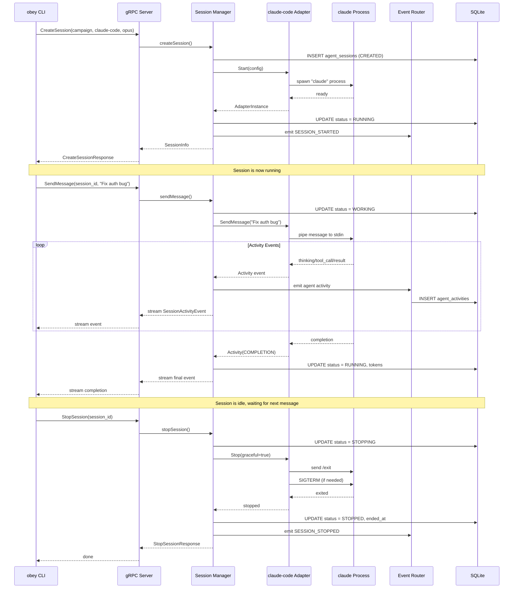

# 02 — gRPC Interface Specification

## Overview

This document defines the gRPC service additions for agent session management. These RPCs are added to the existing `LocalDaemonService` on the Unix domain socket at `$XDG_RUNTIME_DIR/obey/daemon.sock`.

All session RPCs follow the existing daemon patterns:
- Error codes use `oberror` format (`OBEY-NNNN`)
- Errors map to gRPC status codes via `ErrorInterceptor`
- Campaign context is required for all session operations

## Service Definition (Protobuf)

```protobuf
syntax = "proto3";

package obey.local.v1;

option go_package = "github.com/obedience-corp/obey/gen/local/v1;localv1";

import "google/protobuf/timestamp.proto";
import "google/protobuf/duration.proto";

// ═══════════════════════════════════════════════════════════════
// Agent Session Management — additions to LocalDaemonService
// ═══════════════════════════════════════════════════════════════

service LocalDaemonService {
    // ── Existing RPCs (unchanged) ──
    rpc ReportCampaignEvent(CampaignEventRequest) returns (EventResponse);
    rpc ReportFestivalEvent(FestivalEventRequest) returns (EventResponse);
    rpc StreamAgentActivity(stream AgentActivityEvent) returns (ActivityAck);
    rpc Ping(PingRequest) returns (PingResponse);
    rpc GetState(StateRequest) returns (StateResponse);
    rpc Execute(ExecuteRequest) returns (stream ExecuteResponse);
    rpc Shutdown(ShutdownRequest) returns (ShutdownResponse);

    // ── New: Agent Session RPCs ──

    // CreateSession initializes a new agent session bound to a campaign.
    // The session is created in CREATED status. The daemon automatically
    // starts the provider adapter after creation.
    rpc CreateSession(CreateSessionRequest) returns (CreateSessionResponse);

    // GetSession returns the current state of a session.
    rpc GetSession(GetSessionRequest) returns (SessionInfo);

    // ListSessions returns all sessions, optionally filtered by campaign or status.
    rpc ListSessions(ListSessionsRequest) returns (ListSessionsResponse);

    // SendMessage sends a user message to a running session and streams
    // back activity events (thinking, tool calls, results, completion).
    rpc SendMessage(SendMessageRequest) returns (stream SessionActivityEvent);

    // StopSession gracefully stops a running session.
    rpc StopSession(StopSessionRequest) returns (StopSessionResponse);

    // RestartSession stops and re-creates a session with the same config.
    rpc RestartSession(RestartSessionRequest) returns (CreateSessionResponse);

    // WatchSession streams status changes for a session in real-time.
    // Useful for dashboards and CLI progress displays.
    rpc WatchSession(WatchSessionRequest) returns (stream SessionStatusEvent);

    // WatchAllSessions streams status changes for all sessions.
    // Each event includes the session ID so the client can multiplex.
    rpc WatchAllSessions(WatchAllSessionsRequest) returns (stream SessionStatusEvent);
}

// ═══════════════════════════════════════════════════════════════
// Enums
// ═══════════════════════════════════════════════════════════════

enum SessionStatus {
    SESSION_STATUS_UNSPECIFIED = 0;
    SESSION_STATUS_CREATED     = 1;
    SESSION_STATUS_STARTING    = 2;
    SESSION_STATUS_RUNNING     = 3;  // idle, waiting for input
    SESSION_STATUS_WORKING     = 4;  // actively processing a message
    SESSION_STATUS_STOPPING    = 5;
    SESSION_STATUS_STOPPED     = 6;  // terminal: clean shutdown
    SESSION_STATUS_FAILED      = 7;  // terminal: error occurred
}

enum SessionProvider {
    SESSION_PROVIDER_UNSPECIFIED = 0;
    SESSION_PROVIDER_CLAUDE_CODE = 1;
    SESSION_PROVIDER_OPENCLAW    = 2;
    SESSION_PROVIDER_CODEX       = 3;
    SESSION_PROVIDER_OPENAI_API  = 4;
}

enum ActivityType {
    ACTIVITY_TYPE_UNSPECIFIED  = 0;
    ACTIVITY_TYPE_THINKING     = 1;  // model is reasoning
    ACTIVITY_TYPE_TOOL_CALL    = 2;  // model invoked a tool
    ACTIVITY_TYPE_TOOL_RESULT  = 3;  // tool returned a result
    ACTIVITY_TYPE_COMPLETION   = 4;  // model produced final output
    ACTIVITY_TYPE_ERROR        = 5;  // provider error
    ACTIVITY_TYPE_STATUS       = 6;  // status change notification
}

// ═══════════════════════════════════════════════════════════════
// Request / Response Messages
// ═══════════════════════════════════════════════════════════════

// ── CreateSession ──

message CreateSessionRequest {
    // Required: campaign this session is bound to.
    string campaign_id = 1;

    // Required: which AI provider to use.
    SessionProvider provider = 2;

    // Optional: provider-specific model (e.g., "opus", "sonnet", "gpt-4o").
    // If omitted, the adapter uses its default model.
    string model = 3;

    // Optional: human-readable name for this session.
    string agent_name = 4;

    // Optional: bind session to a specific festival.
    string festival_id = 5;

    // Optional: bind session to a specific task.
    string task_id = 6;

    // Optional: provider-specific configuration.
    map<string, string> provider_config = 7;

    // Optional: additional environment variables to inject.
    map<string, string> environment = 8;

    // Optional: token budget (0 = unlimited).
    int64 max_tokens = 9;

    // Optional: session timeout (0 = no timeout).
    google.protobuf.Duration timeout = 10;

    // Optional: initial message to send after session starts.
    // If set, the session will immediately begin working after creation.
    string initial_message = 11;
}

message CreateSessionResponse {
    SessionInfo session = 1;
}

// ── GetSession ──

message GetSessionRequest {
    string session_id = 1;
}

// ── ListSessions ──

message ListSessionsRequest {
    // Optional: filter by campaign.
    string campaign_id = 1;

    // Optional: filter by status.
    repeated SessionStatus statuses = 2;

    // Optional: filter by provider.
    SessionProvider provider = 3;

    // Optional: include stopped/failed sessions (default: active only).
    bool include_terminated = 4;
}

message ListSessionsResponse {
    repeated SessionInfo sessions = 1;
}

// ── SendMessage ──

message SendMessageRequest {
    string session_id = 1;

    // The message to send to the AI session.
    string message = 2;
}

// ── StopSession ──

message StopSessionRequest {
    string session_id = 1;

    // If true, wait for current work to complete before stopping.
    // If false, interrupt immediately.
    bool graceful = 2;
}

message StopSessionResponse {
    SessionInfo session = 1;
}

// ── RestartSession ──

message RestartSessionRequest {
    string session_id = 1;

    // Optional: override provider config for the new session.
    map<string, string> provider_config = 2;
}

// ── WatchSession ──

message WatchSessionRequest {
    string session_id = 1;
}

message WatchAllSessionsRequest {
    // Optional: filter by campaign.
    string campaign_id = 1;
}

// ═══════════════════════════════════════════════════════════════
// Shared Messages
// ═══════════════════════════════════════════════════════════════

message SessionInfo {
    string id = 1;
    string campaign_id = 2;
    SessionProvider provider = 3;
    string model = 4;
    string agent_name = 5;
    SessionStatus status = 6;
    string festival_id = 7;
    string task_id = 8;

    // Token usage
    int64 tokens_input = 9;
    int64 tokens_output = 10;
    int64 max_tokens = 11;

    // Process info (0 if not a process-based provider)
    int32 pid = 12;
    int32 restart_count = 13;

    // Timestamps
    google.protobuf.Timestamp created_at = 14;
    google.protobuf.Timestamp started_at = 15;
    google.protobuf.Timestamp last_activity_at = 16;
    google.protobuf.Timestamp ended_at = 17;

    // Error info (populated when status = FAILED)
    string error_message = 18;

    // Working directory (campaign root)
    string working_dir = 19;
}

message SessionActivityEvent {
    string session_id = 1;
    ActivityType type = 2;
    string content = 3;

    // For TOOL_CALL / TOOL_RESULT
    string tool_name = 4;
    string tool_call_id = 5;
    bool tool_success = 6;

    // Token delta for this event
    int64 tokens_input = 7;
    int64 tokens_output = 8;

    google.protobuf.Timestamp timestamp = 9;
}

message SessionStatusEvent {
    string session_id = 1;
    SessionStatus previous_status = 2;
    SessionStatus new_status = 3;
    string message = 4;  // human-readable context
    google.protobuf.Timestamp timestamp = 5;
}
```

## RPC Behavior Specification

### CreateSession

| Field | Validation |
|-------|-----------|
| `campaign_id` | Required. Must reference a registered campaign. |
| `provider` | Required. Must be a supported provider. |
| `model` | Optional. Validated by the provider adapter. |
| `agent_name` | Optional. Defaults to `"{provider}-{short_id}"`. |
| `max_tokens` | Optional. 0 = unlimited. |
| `timeout` | Optional. 0 = no timeout. |

**Behavior**:
1. Validate inputs
2. Resolve campaign → get campaign root path
3. Generate session ULID
4. Insert `agent_sessions` row (status: `CREATED`)
5. Look up provider adapter
6. Call `adapter.Start()` → status transitions to `STARTING` then `RUNNING`
7. If `initial_message` is set, immediately call `SendMessage` internally
8. Return `SessionInfo`

**Error codes**:
- `OBEY-2001`: Campaign not found
- `OBEY-2002`: Provider not supported
- `OBEY-2003`: Model not supported by provider
- `OBEY-2004`: Session creation failed (adapter error)
- `OBEY-2005`: Campaign sandbox initialization failed

### SendMessage

**Behavior**:
1. Validate session exists and is RUNNING
2. Update status → WORKING
3. Route message to provider adapter
4. Stream `SessionActivityEvent` messages as they arrive from the adapter
5. When provider returns to idle, update status → RUNNING
6. Final event has `type = ACTIVITY_TYPE_COMPLETION`

**Error codes**:
- `OBEY-2010`: Session not found
- `OBEY-2011`: Session not in RUNNING state
- `OBEY-2012`: Message delivery failed
- `OBEY-2013`: Token budget exceeded
- `OBEY-2014`: Session timeout reached

**Streaming behavior**:
```
Client sends: SendMessage("sess_001", "Fix the bug in auth.go")
Server streams:
  → { type: THINKING,    content: "Analyzing the auth.go file..." }
  → { type: TOOL_CALL,   tool_name: "Read", content: "Reading auth.go" }
  → { type: TOOL_RESULT, tool_name: "Read", tool_success: true }
  → { type: THINKING,    content: "Found the issue in line 42..." }
  → { type: TOOL_CALL,   tool_name: "Edit", content: "Fixing auth check" }
  → { type: TOOL_RESULT, tool_name: "Edit", tool_success: true }
  → { type: COMPLETION,  content: "Fixed the auth bug. The issue was..." }
```

### StopSession

**Behavior**:
1. Validate session exists and is in a stoppable state (RUNNING, WORKING, STARTING)
2. Update status → STOPPING
3. If `graceful=true`: wait for current activity to complete (with timeout)
4. Call `adapter.Stop(graceful)`
5. Flush pending activity events
6. Record final token counts
7. Update status → STOPPED, set `ended_at`

**Error codes**:
- `OBEY-2010`: Session not found
- `OBEY-2020`: Session already stopped
- `OBEY-2021`: Graceful stop timed out (session force-killed)

### ListSessions

**Behavior**:
1. Query `agent_sessions` table with optional filters
2. Default: return only active sessions (CREATED, STARTING, RUNNING, WORKING)
3. If `include_terminated=true`: also return STOPPED and FAILED

### WatchSession / WatchAllSessions

**Behavior**:
1. Register a listener for session status changes
2. Stream `SessionStatusEvent` for each state transition
3. Include the previous and new status for transition tracking
4. Stream ends when the session reaches a terminal state (STOPPED, FAILED) or client disconnects

## Error Code Registry

```
OBEY-2000  Agent session error (generic)
OBEY-2001  Campaign not found
OBEY-2002  Provider not supported
OBEY-2003  Model not supported by provider
OBEY-2004  Session creation failed
OBEY-2005  Campaign sandbox initialization failed
OBEY-2010  Session not found
OBEY-2011  Session not in expected state
OBEY-2012  Message delivery failed
OBEY-2013  Token budget exceeded
OBEY-2014  Session timeout reached
OBEY-2020  Session already stopped
OBEY-2021  Graceful stop timed out
OBEY-2030  Provider adapter not initialized
OBEY-2031  Provider process crashed
OBEY-2032  Provider connection lost
```

## Wire Format Examples

### Create a claude-code session

```
→ CreateSessionRequest {
    campaign_id: "camp_ethdenver2026"
    provider: SESSION_PROVIDER_CLAUDE_CODE
    model: "opus"
    agent_name: "coordinator"
    festival_id: "hedera-foundation-HF0001"
    initial_message: "Run fest next and implement the current task"
  }

← CreateSessionResponse {
    session: {
      id: "sess_01JMXYZ..."
      campaign_id: "camp_ethdenver2026"
      provider: SESSION_PROVIDER_CLAUDE_CODE
      model: "opus"
      agent_name: "coordinator"
      status: SESSION_STATUS_RUNNING
      festival_id: "hedera-foundation-HF0001"
      working_dir: "/home/lance/campaigns/ethdenver2026"
      created_at: "2026-02-18T14:30:00Z"
      started_at: "2026-02-18T14:30:01Z"
    }
  }
```

### Send a message and watch activity

```
→ SendMessageRequest {
    session_id: "sess_01JMXYZ..."
    message: "What is the current festival status?"
  }

← stream SessionActivityEvent {
    session_id: "sess_01JMXYZ..."
    type: ACTIVITY_TYPE_THINKING
    content: "Checking festival status..."
    timestamp: "2026-02-18T14:30:05Z"
  }

← stream SessionActivityEvent {
    session_id: "sess_01JMXYZ..."
    type: ACTIVITY_TYPE_TOOL_CALL
    tool_name: "Bash"
    tool_call_id: "tc_001"
    content: "fest status"
    timestamp: "2026-02-18T14:30:06Z"
  }

← stream SessionActivityEvent {
    session_id: "sess_01JMXYZ..."
    type: ACTIVITY_TYPE_TOOL_RESULT
    tool_name: "Bash"
    tool_call_id: "tc_001"
    tool_success: true
    content: "Festival hedera-foundation-HF0001: Phase 001_IMPLEMENT, Sequence 01..."
    timestamp: "2026-02-18T14:30:07Z"
  }

← stream SessionActivityEvent {
    session_id: "sess_01JMXYZ..."
    type: ACTIVITY_TYPE_COMPLETION
    content: "The festival is currently in the first implementation phase..."
    tokens_input: 850
    tokens_output: 340
    timestamp: "2026-02-18T14:30:08Z"
  }
```

## Integration with Existing RPCs

### StreamAgentActivity (existing)

The existing `StreamAgentActivity` RPC is a **client-streaming** endpoint where external processes push activity events into the daemon. With the new session system, this RPC gains a secondary role:

- **Before sessions**: external processes use `StreamAgentActivity` to report their activity
- **With sessions**: the daemon itself generates activity events from provider adapters

Both paths converge on the same `agent_activities` table and event router. No changes to the existing RPC are needed.

### GetState (existing)

The existing `GetState` RPC should be extended to include session summaries:

```protobuf
message StateResponse {
    // ... existing fields ...

    // New: summary of active sessions
    repeated SessionSummary active_sessions = 10;
}

message SessionSummary {
    string id = 1;
    string campaign_id = 2;
    SessionProvider provider = 3;
    string agent_name = 4;
    SessionStatus status = 5;
}
```

## CLI Integration

The `obey` CLI should expose session management commands:

```bash
# Create and start a session
obey session create --campaign ethdenver2026 --provider claude-code --model opus --name coordinator

# List active sessions
obey session list
obey session list --campaign ethdenver2026
obey session list --all  # include terminated

# Send a message to a session
obey session send <session_id> "Implement the next festival task"

# Watch session activity in real-time
obey session watch <session_id>

# Stop a session
obey session stop <session_id>
obey session stop <session_id> --force

# Get session details
obey session info <session_id>
```

## Sequence Diagram (Mermaid)


