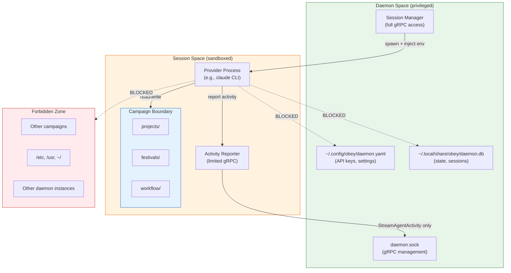

# 04 — Sandbox & Security Model

## Overview

Every agent session operates within a **campaign sandbox** — a security boundary that restricts file access, command execution, and environment exposure to the bound campaign. This document specifies the sandbox enforcement model, credential handling, and security boundaries.

## Sandbox Architecture

```
┌─────────────────────────────────────────────────────────────────────────┐
│                         SANDBOX LAYERS                                   │
│                                                                         │
│  Layer 1: Campaign Boundary                                             │
│  ┌───────────────────────────────────────────────────────────────────┐  │
│  │ All file operations constrained to campaign root                  │  │
│  │ Symlinks resolved before path validation                         │  │
│  │ No traversal above campaign root (../../ etc.)                   │  │
│  └───────────────────────────────────────────────────────────────────┘  │
│                                                                         │
│  Layer 2: Command Allowlist                                             │
│  ┌───────────────────────────────────────────────────────────────────┐  │
│  │ Only pre-approved commands can execute                           │  │
│  │ Default: fest, camp, just, git                                   │  │
│  │ Per-campaign overrides via campaign config                       │  │
│  │ Subcommand restrictions via __manifest                           │  │
│  └───────────────────────────────────────────────────────────────────┘  │
│                                                                         │
│  Layer 3: Environment Isolation                                         │
│  ┌───────────────────────────────────────────────────────────────────┐  │
│  │ OBEY_* namespace reserved for daemon injection                   │  │
│  │ Provider API keys injected, not stored in campaign               │  │
│  │ Campaign-specific env vars from session config                   │  │
│  └───────────────────────────────────────────────────────────────────┘  │
│                                                                         │
│  Layer 4: Process Isolation                                             │
│  ┌───────────────────────────────────────────────────────────────────┐  │
│  │ Session process runs as child of daemon                          │  │
│  │ Process group isolation (crash doesn't take down daemon)         │  │
│  │ Resource limits (optional: ulimit, cgroup)                       │  │
│  └───────────────────────────────────────────────────────────────────┘  │
│                                                                         │
└─────────────────────────────────────────────────────────────────────────┘
```

## Layer 1: Campaign Boundary

### Path Validation Algorithm

```
ValidatePath(requested_path, campaign_root):
  1. If requested_path is relative:
       resolved = filepath.Join(campaign_root, requested_path)
     Else:
       resolved = requested_path

  2. resolved = filepath.EvalSymlinks(resolved)  // resolve ALL symlinks

  3. campaign_real = filepath.EvalSymlinks(campaign_root)

  4. If !strings.HasPrefix(resolved, campaign_real + "/"):
       REJECT — path escapes campaign boundary

  5. If isInDenyList(resolved):  // .env, .git/config, etc.
       REJECT — sensitive file

  6. ALLOW
```

### Boundary Enforcement Points

| Operation | Enforcement |
|-----------|------------|
| File read | Path validated before read |
| File write | Path validated before write |
| Command execution | Working dir forced to campaign root; all path args validated |
| Directory listing | Path validated, cannot list above root |
| Symlink creation | Target must be within campaign boundary |
| Process spawn (provider) | `cmd.Dir` set to campaign root |

### Sensitive File Deny List

These paths within a campaign are blocked from session access:

```
.env                    # environment secrets
.env.*                  # environment variants
**/.env                 # nested env files
**/credentials.json     # GCP/service credentials
**/*secret*             # files with "secret" in name
**/*password*           # files with "password" in name
**/*.pem                # private keys
**/*.key                # private keys
.git/config             # may contain tokens
```

The deny list is configurable per-campaign. Sessions can read `.env.example` and similar non-sensitive patterns.

### ASCII Diagram: Path Validation Flow

```
Request: read "/home/user/campaigns/ethdenver2026/projects/agent-coordinator/main.go"
              │
              ▼
        ┌─────────────┐
        │ Resolve      │
        │ symlinks     │
        └──────┬──────┘
               │
               ▼
        ┌─────────────────────────────────┐
        │ Is resolved path under           │
        │ /home/user/campaigns/ethdenver2026/ ?│
        └──────┬────────────────┬─────────┘
               │                │
            YES ▼             NO ▼
        ┌──────────┐    ┌──────────┐
        │ Check     │    │ REJECT   │
        │ deny list │    │ "path    │
        └────┬─────┘    │ escapes  │
             │          │ boundary"│
          ┌──┴──┐       └──────────┘
          │     │
       OK ▼  DENY ▼
    ┌────────┐ ┌──────────┐
    │ ALLOW  │ │ REJECT   │
    │ read   │ │ "sensitive│
    │        │ │ file"    │
    └────────┘ └──────────┘
```

## Layer 2: Command Allowlist

### Default Allowlist

```yaml
commands:
  fest:
    description: "Festival CLI"
    subcommand_restrictions: none
  camp:
    description: "Campaign CLI"
    subcommand_restrictions: none
  just:
    description: "Task runner"
    subcommand_restrictions: none
  git:
    description: "Version control"
    subcommand_restrictions:
      blocked:
        - push --force
        - reset --hard
        - clean -fd
```

### Per-Campaign Extensions

Campaigns can extend the allowlist in their campaign config:

```yaml
# .campaign/sandbox.yaml
commands:
  go:
    description: "Go toolchain"
    subcommand_restrictions:
      allowed:
        - build
        - test
        - vet
        - mod
      blocked:
        - install  # don't install system-wide
  npm:
    description: "Node package manager"
    subcommand_restrictions:
      allowed:
        - install
        - test
        - run
        - build
  make:
    description: "Make build system"
```

### Command Execution Flow

```
Session → sandbox.Execute("go test ./...")
  │
  ├── Parse command: binary = "go", args = ["test", "./..."]
  │
  ├── Check binary against allowlist
  │   ├── "go" in allowlist? YES → continue
  │   └── "rm" in allowlist? NO → REJECT
  │
  ├── Check subcommand restrictions
  │   ├── "test" in allowed? YES → continue
  │   └── "install" in blocked? YES → REJECT
  │
  ├── Validate path-like arguments
  │   └── "./..." resolves within campaign boundary → OK
  │
  ├── Set working directory to campaign root
  ├── Set process environment (filtered)
  ├── Execute with timeout
  └── Stream stdout/stderr
```

## Layer 3: Environment Isolation

### Environment Variable Categories

```
┌─────────────────────────────────────────────────────────────────┐
│                    PROCESS ENVIRONMENT                           │
│                                                                 │
│  INHERITED (from daemon process):                               │
│    HOME, USER, PATH, SHELL, LANG, TERM                         │
│    (standard system variables)                                  │
│                                                                 │
│  INJECTED BY DAEMON:                                            │
│    OBEY_SESSION_ID=sess_01JMXYZ...                              │
│    OBEY_CAMPAIGN_ID=camp_ethdenver2026                          │
│    OBEY_CAMPAIGN_DIR=/home/user/campaigns/ethdenver2026         │
│    OBEY_PROVIDER=claude-code                                    │
│    OBEY_DAEMON_SOCKET=/run/user/1000/obey/daemon.sock           │
│                                                                 │
│  PROVIDER-SPECIFIC (from daemon config, NOT from campaign):     │
│    ANTHROPIC_API_KEY=sk-ant-...     (for claude-code)           │
│    OPENAI_API_KEY=sk-...            (for openai-api, codex)     │
│    OPENCLAW_API_KEY=...             (for openclaw)              │
│                                                                 │
│  SESSION-SPECIFIC (from CreateSession request):                 │
│    Any key-value pairs from config.environment                  │
│    Validated: no OBEY_* prefix allowed                          │
│                                                                 │
│  FILTERED OUT:                                                  │
│    Any pre-existing OBEY_* vars (reserved namespace)            │
│    AWS_*, GCP_*, AZURE_* (cloud credentials)                    │
│    DATABASE_URL, REDIS_URL (infrastructure secrets)             │
│    SSH_AUTH_SOCK (SSH agent)                                    │
│    GPG_AGENT_INFO (GPG agent)                                   │
└─────────────────────────────────────────────────────────────────┘
```

### API Key Management

Provider API keys are a special case. They must be available to the session process but should not be stored in campaign files:

```
┌──────────────┐     ┌──────────────┐     ┌──────────────┐
│ Daemon Config│────▶│ Session      │────▶│ Provider     │
│              │     │ Manager      │     │ Process      │
│ api_keys:    │     │              │     │              │
│   anthropic: │     │ inject key   │     │ ANTHROPIC_   │
│     sk-ant-  │     │ into process │     │ API_KEY=     │
│              │     │ environment  │     │ sk-ant-...   │
└──────────────┘     └──────────────┘     └──────────────┘

Daemon config location: ~/.config/obey/daemon.yaml
Keys are NEVER written to campaign directories
Keys are NEVER logged or included in activity events
```

## Layer 4: Process Isolation

### Process Group Isolation

```go
// Each session process runs in its own process group
cmd := exec.Command(...)
cmd.SysProcAttr = &syscall.SysProcAttr{
    Setpgid: true,  // new process group
}

// On stop: kill entire process group
syscall.Kill(-cmd.Process.Pid, syscall.SIGTERM)
```

This ensures:
- If the provider spawns child processes, they're all in the same group
- Killing the session kills all its children
- A crash in one session doesn't affect others or the daemon

### Resource Limits (Future Enhancement)

For post-hackathon, sessions can have resource limits:

```yaml
session_limits:
  max_memory_mb: 4096      # memory limit
  max_cpu_seconds: 3600     # CPU time limit
  max_file_size_mb: 100     # largest file a session can create
  max_open_files: 256       # file descriptor limit
  max_processes: 50         # subprocess limit
```

For the hackathon, rely on OS defaults and session timeouts.

## Security Threat Model

### Threats and Mitigations

```
┌─────────────────────┬─────────────────────┬───────────────────────────┐
│ Threat              │ Attack Vector       │ Mitigation                │
├─────────────────────┼─────────────────────┼───────────────────────────┤
│ Path traversal      │ AI requests         │ Symlink-resolved path     │
│                     │ ../../etc/passwd    │ validation against        │
│                     │                     │ campaign root             │
├─────────────────────┼─────────────────────┼───────────────────────────┤
│ Command injection   │ AI constructs       │ Command allowlist +       │
│                     │ malicious commands  │ argument validation       │
├─────────────────────┼─────────────────────┼───────────────────────────┤
│ Secret exfiltration │ AI reads .env,      │ Sensitive file deny list  │
│                     │ logs API keys       │ + env var filtering       │
├─────────────────────┼─────────────────────┼───────────────────────────┤
│ Lateral movement    │ AI accesses other   │ Campaign boundary is      │
│                     │ campaigns/system    │ absolute, no exceptions   │
├─────────────────────┼─────────────────────┼───────────────────────────┤
│ Resource exhaustion │ AI spawns infinite  │ Process group limits +    │
│                     │ subprocesses        │ session timeout           │
├─────────────────────┼─────────────────────┼───────────────────────────┤
│ Daemon takeover     │ AI sends gRPC       │ OBEY_DAEMON_SOCKET is     │
│                     │ commands to daemon  │ read-only for sessions;   │
│                     │                     │ sessions can report       │
│                     │                     │ activity but not manage   │
│                     │                     │ other sessions            │
├─────────────────────┼─────────────────────┼───────────────────────────┤
│ Key theft           │ AI reads daemon     │ Daemon config is outside  │
│                     │ config for API keys │ campaign boundary; keys   │
│                     │                     │ injected as env vars only │
└─────────────────────┴─────────────────────┴───────────────────────────┘
```

### Session-to-Session Isolation

Sessions within the same campaign can see each other's files (they share the campaign boundary). This is by design — they're working in the same workspace, like multiple developers on the same repo.

What sessions CANNOT do:
- **Manage other sessions** — no gRPC access to CreateSession/StopSession for other sessions
- **Read other sessions' activity** — activity events are routed to the daemon, not shared between sessions
- **Access other campaigns** — campaign boundary is absolute

### Daemon Self-Protection

The daemon protects itself from sessions:

```
Session can:
  ✅ Report activity via StreamAgentActivity
  ✅ Execute sandboxed commands
  ✅ Read/write files within campaign

Session cannot:
  ❌ Call CreateSession/StopSession (no session management access)
  ❌ Call Shutdown (daemon management)
  ❌ Modify daemon config
  ❌ Access daemon socket with management privileges
```

This is enforced by having the session process connect to the daemon gRPC with a session-scoped token that limits available RPCs. For the hackathon, this can be simplified to: sessions don't know the daemon socket path (it's injected as `OBEY_DAEMON_SOCKET` with read-only intent, primarily for activity reporting).

## Mermaid: Security Boundary Diagram



## Implementation Checklist

For the hackathon, implement these security measures:

- [ ] Path validation with symlink resolution (exists in current sandbox — reuse)
- [ ] Command allowlist enforcement (exists in current sandbox — reuse)
- [ ] Environment filtering (new: filter OBEY_* and credential vars)
- [ ] API key injection from daemon config (new)
- [ ] Process group isolation (new: `Setpgid: true`)
- [ ] Session timeout enforcement (new)
- [ ] Sensitive file deny list (new: .env, credentials, keys)

Post-hackathon additions:
- [ ] Per-session gRPC token with RPC restrictions
- [ ] Resource limits (cgroup/ulimit)
- [ ] Per-agent sandbox boundaries (within campaign)
- [ ] Audit logging of all sandbox violations
