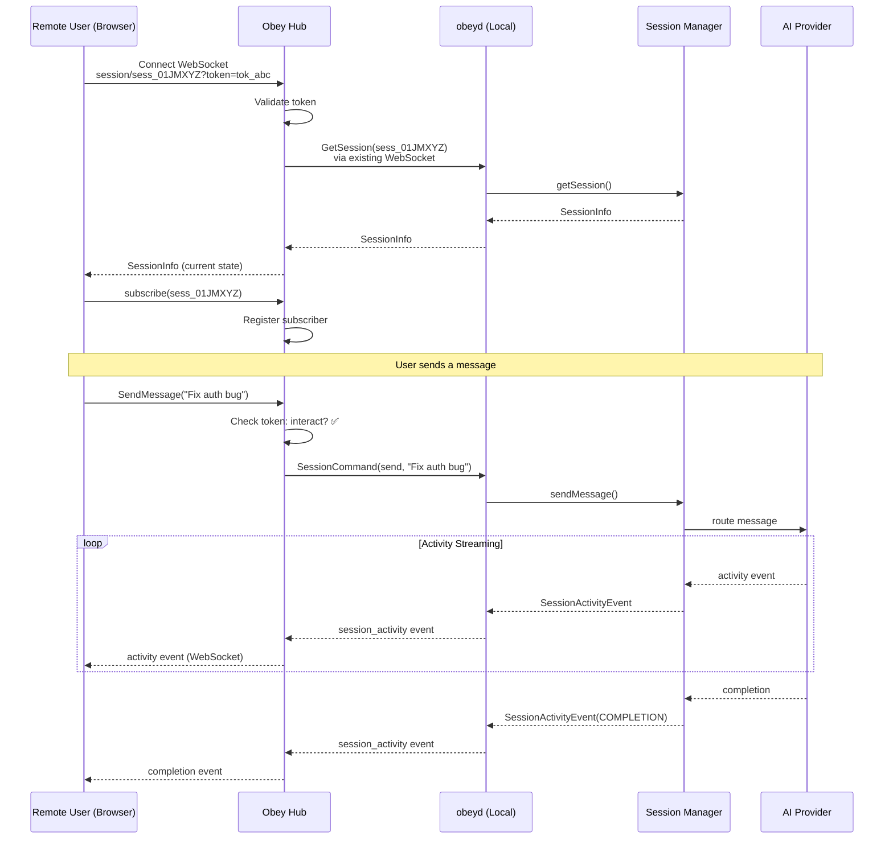

# 05 — WebSocket Remote Access (Stretch Goal)

## Overview

This document specifies the remote session access protocol via the **obey hub**. This is a **stretch goal** — the local gRPC interface (docs 01-04) is the priority. Remote access enables:

1. **Demo link sharing** — send a URL to judges/attendees to watch or interact with sessions
2. **Remote session management** — start/stop sessions from the hub dashboard
3. **Multi-device access** — manage sessions from a phone or different computer

Remote access works by proxying session commands through the existing hub WebSocket connection. The daemon already maintains a WebSocket to `wss://api.obey.app/v1/daemon` — this spec adds session management messages to that protocol.

## Architecture

```
┌────────────────────────────────────────────────────────────────────────┐
│                              REMOTE ACCESS                              │
│                                                                        │
│  ┌──────────┐    HTTPS    ┌──────────────┐   WebSocket  ┌──────────┐  │
│  │ Browser  │────────────▶│  Obey Hub    │─────────────▶│  obeyd   │  │
│  │ (judge)  │             │              │              │  (local) │  │
│  │          │◀────────────│  wss://api.  │◀─────────────│          │  │
│  │ Dashboard│   WebSocket │  obey.app/v1 │  WebSocket   │  Session │  │
│  │ + Chat   │             │              │              │  Manager │  │
│  └──────────┘             └──────────────┘              └──────────┘  │
│                                                                        │
│  Flow:                                                                 │
│  1. Browser → Hub: "send message to session X"                         │
│  2. Hub → Daemon: forward via existing WebSocket                       │
│  3. Daemon → Session Manager → Provider → AI                           │
│  4. AI response streams back: Daemon → Hub → Browser                   │
└────────────────────────────────────────────────────────────────────────┘
```

## ASCII Architecture Diagram

```
REMOTE USER                    OBEY HUB                     LOCAL MACHINE
(browser)                    (cloud server)                (daemon + sessions)
    │                             │                              │
    │  1. Connect to dashboard    │                              │
    │  ─────────────────────────▶ │                              │
    │  https://app.obey.app/      │                              │
    │  /session/sess_01JMXYZ      │                              │
    │                             │                              │
    │  2. Hub authenticates       │                              │
    │  and opens WebSocket        │                              │
    │  ◀─────────────────────────▶│                              │
    │  wss://app.obey.app/v1/    │                              │
    │  session/sess_01JMXYZ       │                              │
    │                             │                              │
    │                             │  3. Hub has existing         │
    │                             │  WebSocket to daemon         │
    │                             │◀────────────────────────────▶│
    │                             │  wss://api.obey.app/v1/     │
    │                             │  daemon (bidirectional)      │
    │                             │                              │
    │  4. User sends message      │                              │
    │  "Fix the auth bug"         │                              │
    │  ─────────────────────────▶ │                              │
    │                             │  5. Hub forwards             │
    │                             │  ─────────────────────────▶  │
    │                             │  SessionMessage {            │
    │                             │    session_id, message       │
    │                             │  }                           │
    │                             │                              │
    │                             │  6. Daemon routes to         │
    │                             │  session, AI processes       │
    │                             │                              │
    │                             │  7. Activity events stream   │
    │                             │  ◀─────────────────────────  │
    │  8. Hub forwards to browser │                              │
    │  ◀───────────────────────── │                              │
    │  (real-time activity feed)  │                              │
    │                             │                              │
```

## Hub Protocol Messages

These are added to the existing hub WebSocket protocol (protobuf-encoded):

### Client → Hub (Browser WebSocket)

```protobuf
// Messages from browser to hub
message HubClientMessage {
    oneof payload {
        SessionSendMessage send_message = 1;
        SessionCreateRemote create_session = 2;
        SessionStopRemote stop_session = 3;
        SessionSubscribe subscribe = 4;
        SessionUnsubscribe unsubscribe = 5;
    }
}

message SessionSendMessage {
    string session_id = 1;
    string message = 2;
}

message SessionCreateRemote {
    string campaign_id = 1;
    string provider = 2;  // "claude-code", "openclaw", etc.
    string model = 3;
    string agent_name = 4;
    string initial_message = 5;
}

message SessionStopRemote {
    string session_id = 1;
    bool graceful = 2;
}

message SessionSubscribe {
    string session_id = 1;  // subscribe to activity events
}

message SessionUnsubscribe {
    string session_id = 1;
}
```

### Hub → Client (Browser WebSocket)

```protobuf
// Messages from hub to browser
message HubServerMessage {
    oneof payload {
        SessionActivityEvent activity = 1;
        SessionStatusEvent status_change = 2;
        SessionInfo session_info = 3;
        SessionList session_list = 4;
        HubError error = 5;
    }
}

// Reuses SessionActivityEvent and SessionStatusEvent from gRPC spec (doc 02)
```

### Hub → Daemon (Existing WebSocket)

The hub forwards session commands to the daemon using the existing bidirectional WebSocket:

```protobuf
// Added to existing DaemonCommand message
message DaemonCommand {
    oneof command {
        // ... existing commands ...

        // New: session management
        SessionCommand session = 10;
    }
}

message SessionCommand {
    oneof action {
        CreateSessionRequest create = 1;
        SendMessageRequest send = 2;
        StopSessionRequest stop = 3;
        ListSessionsRequest list = 4;
        GetSessionRequest get = 5;
    }
    string request_id = 10;  // for correlating responses
}
```

### Daemon → Hub (Existing WebSocket)

Session events are forwarded to the hub through the existing event pipeline:

```protobuf
// Added to existing DaemonEvent message
message DaemonEvent {
    oneof event {
        // ... existing events ...

        // New: session events
        SessionActivityEvent session_activity = 10;
        SessionStatusEvent session_status = 11;
        SessionCommandResponse session_response = 12;
    }
}

message SessionCommandResponse {
    string request_id = 1;  // correlates to SessionCommand.request_id
    oneof response {
        CreateSessionResponse create = 2;
        SessionInfo get = 3;
        ListSessionsResponse list = 4;
        StopSessionResponse stop = 5;
    }
    HubError error = 10;  // populated on failure
}
```

## Authentication & Authorization

### Demo Link Model

For the hackathon, we use a simple bearer token model:

```
Demo link format:
  https://app.obey.app/session/<session_id>?token=<access_token>

Token types:
  - "observe" — can see activity events but NOT send messages
  - "interact" — can see events AND send messages
  - "manage" — can see events, send messages, AND stop the session

Token generation:
  obey session share <session_id> --access observe
  → https://app.obey.app/session/sess_01JMXYZ...?token=tok_abc123

Token storage:
  Daemon generates token, stores in agent_sessions table
  Hub validates token on WebSocket connection
```

### Access Control Matrix

```
┌──────────────┬──────────┬──────────┬──────────┬──────────┐
│ Operation    │ Local    │ Observe  │ Interact │ Manage   │
│              │ (gRPC)   │ (remote) │ (remote) │ (remote) │
├──────────────┼──────────┼──────────┼──────────┼──────────┤
│ View status  │ ✅       │ ✅       │ ✅       │ ✅       │
│ Watch events │ ✅       │ ✅       │ ✅       │ ✅       │
│ Send message │ ✅       │ ❌       │ ✅       │ ✅       │
│ Stop session │ ✅       │ ❌       │ ❌       │ ✅       │
│ Create sess. │ ✅       │ ❌       │ ❌       │ ✅       │
│ List all     │ ✅       │ ❌       │ ❌       │ ✅       │
└──────────────┴──────────┴──────────┴──────────┴──────────┘
```

## Mermaid: Remote Session Flow



## VPS Deployment (Hackathon Fallback)

If the obey hub is not ready, a simple VPS setup can provide remote access:

```
┌──────────────┐     SSH Tunnel      ┌──────────────────────────┐
│ Judge's      │────────────────────▶│ VPS                       │
│ browser      │    (port forward)   │                           │
│              │                     │ ┌──────────────────────┐  │
│              │                     │ │ nginx (reverse proxy)│  │
│              │                     │ └──────────┬───────────┘  │
│              │                     │            │              │
│              │                     │ ┌──────────▼───────────┐  │
│              │                     │ │ simple WebSocket     │  │
│              │                     │ │ proxy (Node/Go)      │  │
│              │                     │ └──────────┬───────────┘  │
│              │                     │            │              │
│              │                     │    gRPC-over-SSH-tunnel   │
│              │                     │            │              │
└──────────────┘                     └────────────┼─────────────┘
                                                  │
                                                  │ SSH tunnel
                                                  │ (grpc → unix socket)
                                                  ▼
                                     ┌──────────────────────────┐
                                     │ Local machine            │
                                     │                          │
                                     │ obeyd (Unix socket)      │
                                     │ Sessions running locally │
                                     └──────────────────────────┘
```

### VPS Setup Steps

1. Provision a small VPS (e.g., DigitalOcean $4/mo droplet)
2. Install nginx + certbot for HTTPS
3. Deploy a minimal WebSocket proxy that:
   - Accepts browser WebSocket connections
   - Forwards to daemon gRPC via SSH tunnel
   - Streams responses back
4. Create SSH tunnel from local machine: `ssh -R 50051:$XDG_RUNTIME_DIR/obey/daemon.sock vps`
5. Share URL: `https://vps.example.com/session/sess_01JMXYZ`

This is a 2-hour setup, suitable for a hackathon fallback.

## Implementation Priority

```
Hackathon:
  1. Local gRPC works (docs 01-04)              ← MUST HAVE
  2. VPS fallback with simple proxy             ← NICE TO HAVE
  3. Hub integration                            ← STRETCH

Post-hackathon:
  4. Full hub protocol with auth tokens
  5. Multi-user session sharing
  6. Session recording and replay
  7. Rate limiting and abuse prevention
```

## Notes for the Obey Team

- The hub WebSocket is **already bidirectional** — adding session commands is additive
- Session activity events should use the **same event pipeline** as campaign/festival events
- Token-based auth for demo links can be simple UUIDs stored in the `agent_sessions` table
- The VPS fallback is independent of the hub — it's a temporary bridge
- When the hub is ready, the VPS proxy is retired and replaced with proper hub routing
